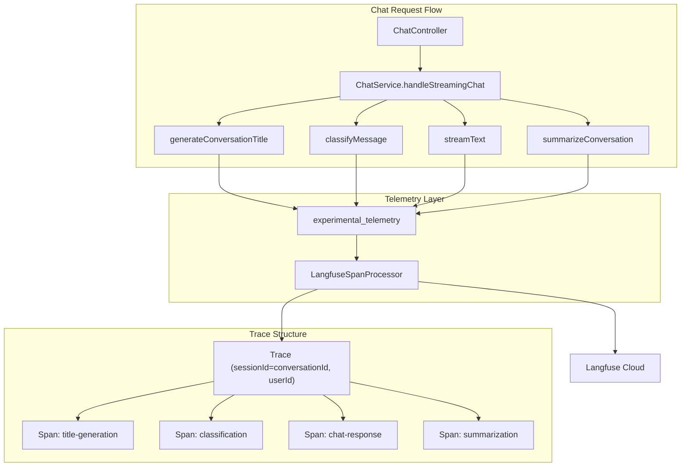

# Langfuse LLM Observability Integration

## Architecture Overview



## Implementation Steps

### Step 1: Modify @paystackhq/nestjs-observability

Update the register.ts to support custom span processors via a hook:

- Add check for `OTEL_SPAN_PROCESSORS_PATH` environment variable
- If set, dynamically import the file and call `getSpanProcessors()` function
- Merge returned processors with the SDK's span processors array

This allows consuming applications to inject custom span processors (like Langfuse) without modifying the core package.

### Step 2: Add Langfuse Dependencies

Install required packages:

```bash
pnpm add langfuse @langfuse/otel
```

### Step 3: Create Langfuse Span Processor Configuration

Create [`src/common/observability/langfuse.config.ts`](src/common/observability/langfuse.config.ts):

- Export `getSpanProcessors()` function that returns `LangfuseSpanProcessor`
- Configure `shouldExportSpan` to only export AI SDK spans (filter out NestJS infrastructure)
- Use environment variables for Langfuse credentials

### Step 4: Create Telemetry Helper

Create [`src/common/ai/telemetry.ts`](src/common/ai/telemetry.ts):

- Define `createTelemetryConfig()` function that builds the `experimental_telemetry` config
- Include sessionId (conversationId), userId, and custom metadata
- Build tags array with mode, page context, service, env, version
- Handle different LLM call types (title generation, classification, streaming, summarization)

### Step 5: Update AI SDK Calls

Modify [`src/common/ai/actions.ts`](src/common/ai/actions.ts):

- Update `generateConversationTitle()` to accept telemetry context and enable experimental_telemetry
- Update `classifyMessage()` with telemetry support
- Update `summarizeConversation()` with telemetry support

### Step 6: Update Chat Service

Modify [`src/modules/chat/chat.service.ts`](src/modules/chat/chat.service.ts):

- Pass telemetry context to all AI function calls
- Include conversation ID, user ID, mode, page context in metadata
- Ensure all LLM calls within a conversation share the same trace (sessionId)

### Step 7: Environment Configuration

Add required environment variables:

```env
# Langfuse Configuration
LANGFUSE_PUBLIC_KEY=pk-lf-...
LANGFUSE_SECRET_KEY=sk-lf-...
LANGFUSE_BASE_URL=https://cloud.langfuse.com

# Span Processor Hook
OTEL_SPAN_PROCESSORS_PATH=./dist/common/observability/langfuse.config.js
```

### Key Files to Modify

| File | Changes ||------|---------|| `@paystackhq/nestjs-observability/register.ts` | Add span processor hook support || [`src/common/observability/langfuse.config.ts`](src/common/observability/langfuse.config.ts) | New - Langfuse span processor setup || [`src/common/ai/telemetry.ts`](src/common/ai/telemetry.ts) | New - Telemetry configuration helper || [`src/common/ai/actions.ts`](src/common/ai/actions.ts) | Enable telemetry on all LLM calls || [`src/modules/chat/chat.service.ts`](src/modules/chat/chat.service.ts) | Pass telemetry context throughout || [`package.json`](package.json) | Add langfuse dependencies |

### Trace Structure

Each conversation will produce traces with:

- **Trace ID**: Auto-generated by OTEL
- **Session ID**: `conversationId` (groups all LLM calls in a conversation)
- **User ID**: From JWT authentication
- **Metadata**:
- `mode`: "global" or "page"
- `pageContext.type`: transaction, customer, etc. (when applicable)
- `pageContext.resourceId`: Resource ID (when applicable)
- `service`: "command-centre-api"
- `environment`: From `OTEL_SERVICE_ENV`
- `version`: From `OTEL_SERVICE_VERSION`
- **Tags**:
- `mode:global` or `mode:page`
