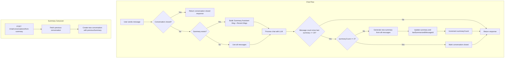

# Message Summarization Implementation Plan

## Architecture Overview

**Key Principles:**

1. Messages are never deleted - preserved for UI display
2. Summary is injected as the **first assistant message** (not in system prompt) to keep prompts lean
3. LLM receives: `[Summary as Assistant Message] + [Recent Messages] + [Current User Message]`



## Files to Modify

### 1. Conversation Entity

**File:** [src/modules/chat/entities/conversation.entity.ts](src/modules/chat/entities/conversation.entity.ts)

Add new fields:

```typescript
@Column({ nullable: true })
summary?: string;  // Current summary text (accumulates context from previous summaries)

@Column({ default: 0 })
summaryCount: number;  // Number of times summarized (max 2)

@Column({ nullable: true })
previousSummary?: string;  // Summary carried over from a previous closed conversation

@Column({ nullable: true })
lastSummarizedMessageId?: string;  // ID of the last message included in the summary

@Column({ default: false })
isClosed: boolean;  // True after 2 summaries
```

### 2. Summarization Action

**File:** `src/common/ai/actions.ts` (modify existing)

Add a new `summarizeConversation` function using `generateText`:

- Input: Array of messages
- Output: Concise summary preserving key context (topics discussed, data fetched, insights provided)
- Uses `gpt-4o-mini` for cost efficiency

### 3. Summarization Prompt

**File:** [src/common/ai/prompts.ts](src/common/ai/prompts.ts)

Add `CONVERSATION_SUMMARY_PROMPT` that instructs the LLM to:

- Summarize the key topics and user intents
- Preserve important data points (transaction IDs, customer info, dates)
- Keep it concise but comprehensive for context continuity

### 4. Chat Service Logic

**File:** [src/modules/chat/chat.service.ts](src/modules/chat/chat.service.ts)

Modify `handleStreamingChat` to:

1. **Check if closed:** Return early with "conversation closed" response if `isClosed === true`
2. **Build LLM context:**
   - If `summary` exists: Use summary + only messages created after `lastSummarizedMessageId`
   - If no summary: Use all messages (current behavior)

3. **Process the chat normally**
4. **After response, check if summarization needed:**
   - Count messages since last summary (or all messages if no summary yet)
   - If count >= 20 and `summaryCount < 2`:
     - Call `summarizeConversation(allMessages)` - summarize the FULL history
     - Update `summary` with new summary (incorporate previous summary if exists)
     - Set `lastSummarizedMessageId` to the latest message ID
     - Increment `summaryCount`
   - If `summaryCount` reaches 2 after this summarization, set `isClosed = true`

**Important:** Messages are NEVER deleted. The UI can always display full message history.

### 5. Build Messages with Summary (Assistant Message Approach)

**File:** [src/modules/chat/chat.service.ts](src/modules/chat/chat.service.ts)

Instead of adding summary to the system prompt (which would bloat it), inject the summary as the **first assistant message**. This keeps the system prompt lean and treats the summary as compressed conversation history.

```typescript
// In a new buildMessagesForLLM method
private buildMessagesForLLM(
  conversation: Conversation,
  recentMessages: UIMessage[],
  currentUserMessage: UIMessage
): UIMessage[] {
  const messages: UIMessage[] = [];

  // If summary exists, inject it as first assistant message
  if (conversation.previousSummary || conversation.summary) {
    const summaryParts: string[] = [];

    if (conversation.previousSummary) {
      summaryParts.push(`**Carried over from previous conversation:**\n${conversation.previousSummary}`);
    }

    if (conversation.summary) {
      summaryParts.push(`**Earlier in this conversation:**\n${conversation.summary}`);
    }

    messages.push({
      id: 'summary-context',
      role: 'assistant',
      parts: [{
        type: 'text',
        text: `[Conversation Summary]\n\nHere's what we've discussed so far:\n\n${summaryParts.join('\n\n')}`
      }]
    });
  }

  // Add recent messages (after lastSummarizedMessageId) + current user message
  messages.push(...recentMessages, currentUserMessage);

  return messages;
}
```

**Why assistant message over system prompt:**

1. **Keeps system prompt lean** - avoids bloating with potentially 500+ token summaries
2. **Semantically correct** - summary IS conversation history, belongs in message stream
3. **Natural continuity** - model treats it as "what I previously knew"
4. **Scalable** - with 2 summaries + carryover, content can stack significantly

The messages sent to the LLM will be:

- **With summary:** `[Summary Assistant Message] + [Recent Messages after lastSummarizedMessageId] + [Current User Message]`
- **Without summary:** All messages (current behavior)

### 6. New DTOs

**File:** `src/modules/chat/dto/create-conversation-from-summary.dto.ts` (new)

```typescript
export class CreateConversationFromSummaryDto {
  previousConversationId: string; // ID of the closed conversation
  mode: ChatMode;
  pageContext?: PageContext;
}
```

### 7. Conversation Response DTO

**File:** [src/modules/chat/dto/conversation-response.dto.ts](src/modules/chat/dto/conversation-response.dto.ts)

Add fields: `summary`, `summaryCount`, `isClosed`, `previousSummary`, `lastSummarizedMessageId`

This allows the frontend to:

- Show the conversation state (open/closed)
- Display summary info if needed
- Know which messages are "summarized" vs "recent"

### 8. New API Endpoint

**File:** [src/modules/chat/chat.controller.ts](src/modules/chat/chat.controller.ts)

Add endpoint:

```typescript
@Post('conversations/from-summary')
async createConversationFromSummary(
  @Body() dto: CreateConversationFromSummaryDto,
  @CurrentUser() userId: string
)
```

### 9. Chat Service - Carryover Method

**File:** [src/modules/chat/chat.service.ts](src/modules/chat/chat.service.ts)

Add method:

```typescript
async createConversationFromSummary(dto: CreateConversationFromSummaryDto, userId: string) {
  const previousConversation = await this.conversationRepository.findByIdAndUserId(dto.previousConversationId, userId);
  // Combine previousSummary + summary into new conversation's previousSummary
  // Create new conversation with title "Continued: {originalTitle}"
}
```

### 10. Message Repository Update

**File:** [src/modules/chat/repositories/message.repository.ts](src/modules/chat/repositories/message.repository.ts)

Add methods:

```typescript
// Count all messages in a conversation
async countByConversationId(conversationId: string): Promise<number>

// Find messages created after a specific message (for getting "new" messages post-summary)
async findMessagesAfterMessageId(conversationId: string, afterMessageId: string): Promise<Message[]>

// Count messages after a specific message (to check if summarization threshold reached)
async countMessagesAfterMessageId(conversationId: string, afterMessageId: string): Promise<number>
```

## Configuration

Add to environment/config:

- `SUMMARIZATION_THRESHOLD`: 20 (messages before summarization)
- `MAX_SUMMARIES`: 2 (summaries before conversation closes)

## Response Handling

When conversation is closed, return a special response type:

```typescript
export enum ChatResponseType {
  CHAT_RESPONSE = 'CHAT_RESPONSE',
  REFUSAL = 'REFUSAL',
  CONVERSATION_CLOSED = 'CONVERSATION_CLOSED', // New
}
```

The closed response includes:

- Message explaining the conversation limit
- The conversation ID for carryover
- Flag indicating summary is available
