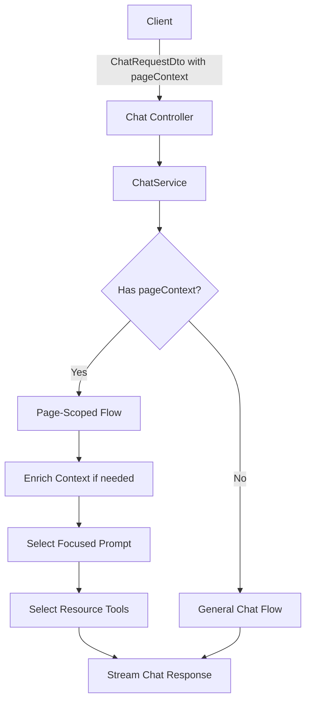

# Page-Scoped Chat Integration

## Architecture Overview



## 1. Define Page Context Types

Create new types in [`src/common/ai/types/page-context.ts`](src/common/ai/types/page-context.ts):

```typescript
export enum PageContextType {
  TRANSACTION = 'transaction',
  CUSTOMER = 'customer',
  REFUND = 'refund',
  PAYOUT = 'payout',
  DISPUTE = 'dispute',
}

export interface PageContext {
  type: PageContextType;
  resourceId: string; // ID or reference
  resourceData?: unknown; // Optional pre-fetched data from client
}
```

## 2. Update ChatRequestDto

Modify [`src/modules/chat/dto/chat-request.dto.ts`](src/modules/chat/dto/chat-request.dto.ts) to accept optional page context:

```typescript
@ApiPropertyOptional({ description: 'Page context for resource-scoped chat' })
@IsOptional()
@ValidateNested()
@Type(() => PageContextDto)
pageContext?: PageContextDto;
```

## 3. Create Focused System Prompt

Add to [`src/common/ai/prompts.ts`](src/common/ai/prompts.ts):

```typescript
export const PAGE_SCOPED_SYSTEM_PROMPT = `You are a Paystack assistant helping with a specific {{RESOURCE_TYPE}}.

## Current Context
**Today's Date**: {{CURRENT_DATE}}
**Resource Type**: {{RESOURCE_TYPE}}
**Resource Details**:
{{RESOURCE_DATA}}

## Your Focus
You are assisting with this specific {{RESOURCE_TYPE}}. Answer questions about:
- The details and status of this {{RESOURCE_TYPE}}
- Related data (e.g., customer info, associated transactions)
- What actions might be relevant
- Explaining any fields or statuses

## Limitations
- Stay focused on this {{RESOURCE_TYPE}} and directly related data
- You cannot modify data or perform actions
- Use available tools to fetch related information when needed
`;
```

## 4. Define Resource-Specific Tool Sets

Add to [`src/common/ai/tools.ts`](src/common/ai/tools.ts):

```typescript
const RESOURCE_TOOL_MAP: Record<PageContextType, string[]> = {
  transaction: ['getCustomers', 'getRefunds', 'getDisputes'],
  customer: ['getTransactions', 'getRefunds'],
  refund: ['getTransactions', 'getCustomers'],
  payout: ['getTransactions'],
  dispute: ['getTransactions', 'getCustomers', 'getRefunds'],
};

export function createPageScopedTools(
  paystackService: PaystackApiService,
  getJwtToken: () => string | undefined,
  contextType: PageContextType,
): Record<string, Tool> {
  const allTools = createTools(paystackService, getJwtToken);
  const allowedTools = RESOURCE_TOOL_MAP[contextType];
  return Object.fromEntries(Object.entries(allTools).filter(([name]) => allowedTools.includes(name)));
}
```

## 5. Add Context Enrichment Service

Create [`src/common/services/page-context.service.ts`](src/common/services/page-context.service.ts):

- Validate the page context
- Fetch resource data if not provided by client
- Format resource data for prompt injection

## 6. Update ChatService

Modify [`src/modules/chat/chat.service.ts`](src/modules/chat/chat.service.ts) `handleStreamingChat`:

```typescript
async handleStreamingChat(dto: ChatRequestDto, userId: string, jwtToken: string) {
  // ... existing validation ...

  const isPageScoped = !!dto.pageContext;

  let systemPrompt: string;
  let tools: Record<string, Tool>;

  if (isPageScoped) {
    const enrichedContext = await this.pageContextService.enrichContext(
      dto.pageContext, jwtToken
    );
    systemPrompt = this.buildPageScopedPrompt(enrichedContext);
    tools = createPageScopedTools(
      this.paystackService, getJwtToken, dto.pageContext.type
    );
  } else {
    systemPrompt = CHAT_AGENT_SYSTEM_PROMPT.replace(...);
    tools = createTools(this.paystackService, getJwtToken);
  }

  // ... rest of streaming logic ...
}
```

## File Changes Summary

| File | Change |

|------|--------|

| `src/common/ai/types/page-context.ts` | New - PageContext types and enum |

| `src/common/ai/types/index.ts` | Export new types |

| `src/modules/chat/dto/page-context.dto.ts` | New - DTO with validation |

| `src/modules/chat/dto/chat-request.dto.ts` | Add optional pageContext field |

| `src/common/ai/prompts.ts` | Add PAGE_SCOPED_SYSTEM_PROMPT |

| `src/common/ai/tools.ts` | Add createPageScopedTools function |

| `src/common/services/page-context.service.ts` | New - Context enrichment service |

| `src/modules/chat/chat.service.ts` | Branch logic for page-scoped chat |

| `src/modules/chat/chat.module.ts` | Register PageContextService |
