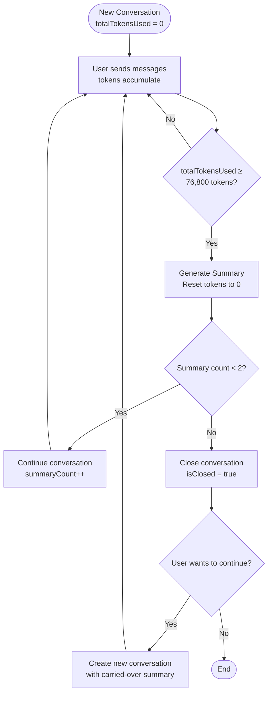

# AI Features

This document covers all AI-powered features in the Command Centre API, including chat modes, tools, charting, and guardrails.

## Chat Modes

The API supports two distinct chat modes:

### Global Mode (Default)

Global mode is for general dashboard queries across all resources. It provides:

- Access to all available Paystack tools
- General conversation about dashboard, transactions, customers, refunds, payouts, and disputes
- Broad context understanding across the merchant's entire account

**Example Request:**

```json
{
  "conversationId": "550e8400-e29b-41d4-a716-446655440000",
  "mode": "global",
  "message": {
    "role": "user",
    "parts": [{ "type": "text", "text": "What's my revenue today?" }]
  }
}
```

### Page-Scoped Mode

Page-scoped mode locks conversations to specific resources (transactions, customers, refunds, payouts, or disputes). It provides:

- **Context-aware responses**: AI knows the specific resource being discussed
- **Automatic resource enrichment**: Fetches and formats resource data for enhanced understanding
- **Filtered tools**: Only tools relevant to the resource type are available
- **Out-of-page-scope protection**: Refuses queries unrelated to the specific resource
- **Persistent context**: Conversations remain locked to the same resource

**Example Request:**

```json
{
  "conversationId": "550e8400-e29b-41d4-a716-446655440000",
  "mode": "page",
  "pageContext": {
    "type": "transaction",
    "resourceId": "123456"
  },
  "message": {
    "role": "user",
    "parts": [{ "type": "text", "text": "What's the status of this transaction?" }]
  }
}
```

## Paystack Tools

The assistant can only operate on merchant data exposed by these tools (all requests reuse the caller's JWT):

### Data Retrieval Tools

| Tool                | Description                    | Key Filters                                       |
| ------------------- | ------------------------------ | ------------------------------------------------- |
| `getTransactions`   | Fetch payment transactions     | status, channel, customer, date, amount, currency |
| `getCustomers`      | List/search customers          | email, account_number, pagination                 |
| `getRefunds`        | Fetch refund data              | status, date, amount (with operators: gt, lt, eq) |
| `getPayouts`        | Fetch payout/settlement data   | status, date, subaccount                          |
| `getDisputes`       | Fetch dispute data             | status, date, transaction, category               |
| `generateChartData` | Generate chart-ready analytics | resourceType, aggregationType, date range         |

### Data Export Tools

| Tool                 | Description                                           | Key Filters                                       | Delivery Method    |
| -------------------- | ----------------------------------------------------- | ------------------------------------------------- | ------------------ |
| `exportTransactions` | Export transaction data to email                      | status, channel, customer, date, amount, currency | Email              |
| `exportRefunds`      | Export refund data to email                           | status, date, search                              | Email              |
| `exportPayouts`      | Export payout data and receive immediate download URL | status, date, subaccount                          | S3 URL (immediate) |
| `exportDisputes`     | Export dispute data to email                          | status, date, transaction, category               | Email              |

**Export Features:**

- Email exports are sent to the authenticated user's email address
- Payout exports return an S3 download URL immediately (no email)
- All export tools validate data exists before triggering export
- Support similar filters as their corresponding GET tools

**Important**: All date filters are limited to 30 days; helper validation returns clear errors when exceeded.

### Filter Validation

All data retrieval tools automatically validate filter parameters before making API calls, ensuring only supported filters are used for each resource type. This prevents errors and provides clear feedback when unsupported filters are attempted.

**How It Works:**

The filter validation system uses a centralized approach with:

- **Allowed filter constants**: Predefined lists of supported filters per resource type (e.g., `TRANSACTION_ALLOWED_FILTERS`)
- **Filter detection**: `findUnsupportedFilters()` identifies any filters not in the allowed list
- **Error generation**: `buildUnsupportedFilterError()` creates user-friendly error messages

**Supported Filters by Resource Type:**

| Resource Type   | Supported Filters                                                                    |
| --------------- | ------------------------------------------------------------------------------------ |
| **Transaction** | perPage, page, from, to, status, channel, customer, amount, currency, subaccountCode |
| **Customer**    | perPage, page, email, account_number                                                 |
| **Refund**      | perPage, page, from, to, status, amount, amount_operator, transaction, search        |
| **Payout**      | perPage, page, from, to, status, subaccount, id                                      |
| **Dispute**     | perPage, page, from, to, status, ignore_resolved, transaction, category, resolution  |

**Example Error Response:**

When an unsupported filter is used, the tool returns a helpful error:

```json
{
  "error": "The filter option foo is not available for transactions. Supported filters: perPage, page, from, to, status, channel, customer, amount, currency, subaccountCode."
}
```

For multiple unsupported filters:

```json
{
  "error": "The filter options foo, bar are not available for customers. Supported filters: perPage, page, email, account_number."
}
```

**Benefits:**

- **Clear feedback**: Users immediately know which filters are supported
- **Prevents API errors**: Validation happens before making Paystack API calls
- **Consistent experience**: All retrieval tools use the same validation pattern
- **Developer-friendly**: Easy to add validation for new tools and resource types

**Implementation:**

Filter validation is automatic and internal - no API or configuration changes required. The system uses:

- `src/common/ai/utilities/retreival-filter-validation.ts` - Filter constants and validation functions
- Applied automatically in all retrieval tool execute functions

### Response Sanitization for Token Efficiency

All data retrieval tools automatically sanitize their responses before returning data to the LLM, significantly reducing token consumption while preserving essential context. This enables longer conversations with more tool calls before reaching summarization thresholds.

**How It Works:**

The sanitization system uses a configuration-driven approach with three sanitization levels:

- **MINIMAL** (85-87% token reduction): Only critical identification fields (IDs, amounts, status)
- **STANDARD** (70-75% token reduction, **default**): Most commonly needed fields for general queries
- **DETAILED** (60-65% token reduction): More fields for complex queries

**Token Savings by Resource Type (STANDARD Level):**

| Resource Type   | Reduction | Fields Removed                                       | Fields Preserved                                                         |
| --------------- | --------- | ---------------------------------------------------- | ------------------------------------------------------------------------ |
| **Transaction** | ~75%      | Log history, metadata, verbose authorization details | ID, reference, amount, status, channel, fees, customer email/phone       |
| **Customer**    | ~62%      | Full authorization arrays, internal metadata         | ID, email, customer code, name, phone, risk action, first 3 saved cards  |
| **Refund**      | ~71%      | Internal processing details, bank references         | ID, amount, status, transaction ref, refund type, customer basic info    |
| **Payout**      | ~57%      | Detailed subaccount fields, processing metadata      | ID, amounts, status, settlement date, fees, subaccount business name     |
| **Dispute**     | ~75%      | Full message threads, extensive history              | ID, refund amount, status, category, customer info, last 5 history items |

**Nested Object Handling:**

The system intelligently sanitizes nested objects:

- Customer objects within transactions are reduced to essential fields (ID, email, phone)
- Authorization data keeps only card identification (bin, last4, bank) without sensitive details
- Array fields are limited (e.g., first 3 authorizations, last 5 dispute history items)
- Null values and missing fields are handled gracefully

**Impact on Conversations:**

- **2.5x more tool calls** before hitting summarization threshold
- Conversations can include **25-40 tool-heavy interactions** vs 10-15 without sanitization
- Default threshold remains at 76,800 tokens (60% of 128K context window)
- Longer coherent conversations without losing context

**Example: Transaction Sanitization**

```typescript
// Raw API response (30+ fields, ~400 tokens per transaction)
{
  id: 1,
  reference: 'ref123',
  amount: 50000,
  currency: 'NGN',
  status: 'success',
  channel: 'card',
  gateway_response: 'Approved',
  fees: 750,
  paid_at: '2024-01-01T12:00:00Z',
  customer: {
    id: 100,
    email: 'customer@example.com',
    customer_code: 'CUS_xxx',
    phone: '+234...',
    // ... 8 more fields
  },
  authorization: {
    authorization_code: 'AUTH_xxx',
    bin: '408408',
    last4: '4081',
    bank: 'Test Bank',
    brand: 'visa',
    card_type: 'visa',
    channel: 'card'
    // ... 8 more fields removed
  },
  // log, metadata, fees_split, additional_charges removed entirely
}

// After sanitization (~100 tokens per transaction)
// 75% token reduction per transaction
```

**Implementation:**

Sanitization is automatic and internal - no API or configuration changes required. The system uses:

- `src/common/ai/sanitization/config.ts` - Field configurations per resource type
- `src/common/ai/sanitization/sanitizer.ts` - Core filtering engine
- Applied automatically in all retrieval tool responses

**Extensibility:**

Adding sanitization for new resource types requires:

1. Add resource type to `ResourceType` enum
2. Define field configurations at all three levels
3. Create convenience sanitization function
4. Apply in retrieval tool response

### Resource-Specific Tool Filtering

In page-scoped mode, tools are automatically filtered based on the resource type:

| Resource Type   | Available Tools                                       |
| --------------- | ----------------------------------------------------- |
| **Transaction** | `getCustomers`, `getRefunds`, `getDisputes`           |
| **Customer**    | `getTransactions`, `getRefunds`, `exportTransactions` |
| **Refund**      | `getTransactions`, `getCustomers`                     |
| **Payout**      | `getTransactions`                                     |
| **Dispute**     | `getTransactions`, `getCustomers`, `getRefunds`       |

This filtering ensures the AI only suggests actions that make sense in the current context.

## Charting & Aggregation

The `generateChartData` tool provides powerful analytics capabilities across multiple resource types.

### Supported Resource Types & Aggregations

| Resource        | Available Aggregations                                                            |
| --------------- | --------------------------------------------------------------------------------- |
| **Transaction** | by-day, by-hour, by-week, by-month, by-status, **by-channel** (payment channel)   |
| **Refund**      | by-day, by-hour, by-week, by-month, by-status, **by-type** (full/partial)         |
| **Payout**      | by-day, by-hour, by-week, by-month, by-status                                     |
| **Dispute**     | by-day, by-hour, by-week, by-month, by-status, **by-category**, **by-resolution** |

### Aggregation Types

| Type            | Description                                          | Output         |
| --------------- | ---------------------------------------------------- | -------------- |
| `by-day`        | Daily trends with day names (e.g., "Monday, Nov 25") | Area chart     |
| `by-hour`       | Hourly patterns (00:00 - 23:00 UTC)                  | Bar chart      |
| `by-week`       | Weekly overview (ISO week format: YYYY-Www)          | Area chart     |
| `by-month`      | Monthly trends (YYYY-MM)                             | Area chart     |
| `by-status`     | Status distribution                                  | Doughnut chart |
| `by-channel`    | Payment channel breakdown (card/bank/mobile_money)   | Doughnut chart |
| `by-type`       | Refund type breakdown (full/partial)                 | Doughnut chart |
| `by-category`   | Dispute category (fraud/chargeback)                  | Doughnut chart |
| `by-resolution` | Dispute resolution outcomes                          | Doughnut chart |

### Output Format (Recharts-compatible)

**Time-based aggregations** return per-currency series:

```json
{
  "success": true,
  "label": "Daily Transaction Metrics",
  "chartType": "area",
  "chartSeries": [
    {
      "currency": "NGN",
      "points": [{ "name": "Monday, Dec 1", "count": 45, "volume": 2500000, "average": 55555, "currency": "NGN" }]
    }
  ],
  "summary": {
    "totalCount": 450,
    "totalVolume": 25000000,
    "overallAverage": 55555,
    "perCurrency": [
      { "currency": "NGN", "totalCount": 400, "totalVolume": 20000000, "overallAverage": 50000 },
      { "currency": "USD", "totalCount": 50, "totalVolume": 5000000, "overallAverage": 100000 }
    ],
    "dateRange": { "from": "Dec 1, 2024", "to": "Dec 15, 2024" }
  }
}
```

**Categorical aggregations** return flat chart data:

```json
{
  "chartType": "doughnut",
  "chartData": [
    { "name": "success", "count": 400, "volume": 20000000, "average": 50000, "currency": "NGN" },
    { "name": "failed", "count": 50, "volume": 0, "average": 0, "currency": "NGN" }
  ]
}
```

### Chart Features

- Streams progress updates while fetching data (up to 1,000 records across 10 pages)
- Multi-currency support with per-currency series and breakdowns
- Automatic chart type suggestion based on aggregation
- Comprehensive summary statistics with per-currency breakdown
- Date range validation (30-day maximum)
- Resource-specific validation of aggregation types
- **Centralized validation system** (`utilities/chart-validation.ts`) for consistent parameter validation
- **Channel filtering** for transaction-specific payment channel analysis

## Guardrails & Classification

The system employs a dual-layer classification mechanism using GPT-4o-mini:

### Out-of-Scope Protection (Global)

Classifier ensures conversations stay within allowed intents:

- Dashboard insights
- Paystack product FAQs
- Account help
- Assistant capabilities

Out-of-scope requests (e.g., general knowledge, unrelated topics) receive a polite refusal:

> "I can only help with questions about your Paystack merchant dashboard (transactions, refunds, customers, disputes, payouts) and Paystack product usage. Ask me something like 'What's my revenue today?'"

### Out-of-Page-Scope Protection (Page Mode)

Additional classification layer for resource-scoped conversations:

- Ensures questions are relevant to the specific resource being viewed
- Prevents context confusion across different resource types

Refusal message:

> "I can only help with questions about this specific {resource_type}. Ask me something like 'What's the status of this {resource_type}?'"

### Additional Classification Features

- System prompt includes current date for accurate relative time understanding
- Classification considers full conversation history for context
- Graceful error handling with helpful suggestions for reformulating queries

## Message & Mode Validation

The system performs several validation steps to ensure conversation integrity and proper mode usage.

### Conversation Mode Validation

The `validateChatMode()` method ensures conversations maintain consistent mode and context:

**Rules:**

1. **Mode Consistency**: Conversations created with a specific mode (global or page-scoped) cannot change modes
2. **Page Context Immutability**: Page-scoped conversations remain locked to the original resource (type + ID)
3. **Global → Page Prevention**: Global conversations cannot be converted to page-scoped mode
4. **Required Context**: Page-scoped mode requires valid `pageContext` with `type` and `resourceId`

**Error Codes:**

- `CONVERSATION_MODE_LOCKED`: Attempting to change conversation mode or use wrong mode
- `CONTEXT_MISMATCH`: Attempting to use different page context than originally set
- `MISSING_REQUIRED_FIELD`: Missing required `pageContext` when using page mode

**Example Validation Flow:**

```typescript
// First message: Creates page-scoped conversation
POST /chat/stream
{
  "conversationId": "abc-123",
  "mode": "page",
  "pageContext": { "type": "transaction", "resourceId": "txn_123" }
}

// Subsequent messages: Must use same mode and context
POST /chat/stream
{
  "conversationId": "abc-123",
  "mode": "page",
  "pageContext": { "type": "transaction", "resourceId": "txn_123" } // ✓ Valid
}

// This will fail with CONTEXT_MISMATCH
POST /chat/stream
{
  "conversationId": "abc-123",
  "mode": "page",
  "pageContext": { "type": "customer", "resourceId": "cust_456" } // ✗ Invalid
}
```

### Message Validation

The `validateMessages()` method validates message history against tool schemas before sending to the LLM:

**What It Does:**

- Validates UI message format using Vercel AI SDK's `validateUIMessages()`
- Ensures message parts match expected tool schemas
- Handles validation errors gracefully without failing the entire request

**Error Handling:**

- If validation fails due to `TypeValidationError`, the system logs the error and starts with empty history
- This prevents database schema evolution issues from breaking conversations
- Future enhancement: Implement message migration or intelligent filtering

**Stream Consumption:**

The streaming implementation ensures streams run to completion even if the client aborts:

```typescript
const result = streamText({
  model: openai('gpt-4o-mini'),
  system: systemPrompt,
  messages: convertToModelMessages(validatedMessages),
  tools,
});

// Consume the stream to ensure onFinish triggers
void result.consumeStream();
```

This guarantees that:

- Messages are saved to database via `onFinish()` callback
- Summarization logic executes properly
- No partial state corruption occurs

## Resource Context Enrichment

When using page-scoped mode, the system automatically enriches conversations with resource-specific data.

### How It Works

1. **Resource Fetching**: `PageContextService` fetches the specific resource data from Paystack API
2. **Data Formatting**: Resource data is formatted into a human-readable structure
3. **Prompt Injection**: Formatted data is injected into the system prompt for AI context
4. **Enhanced Understanding**: AI can answer questions about the specific resource with full context

### Supported Resources

| Resource         | Data Fields                                                                                   |
| ---------------- | --------------------------------------------------------------------------------------------- |
| **Transactions** | ID, reference, amount, status, channel, customer details, payment info, currency              |
| **Customers**    | ID, customer code, email, name, phone, risk action, saved cards                               |
| **Refunds**      | ID, amount, status, transaction reference, refund type (full/partial), notes, currency        |
| **Payouts**      | ID, total amount, effective amount, status, settlement date, fees, currency                   |
| **Disputes**     | ID, refund amount, status, resolution, category (fraud/chargeback), due date, notes, currency |

### Example Context

When viewing transaction ID `123456`, the AI receives formatted context like:

```md
Transaction Details:

- ID: 123456
- Reference: ref_abc123xyz
- Amount: NGN 50000
- Status: success
- Channel: card
- Customer Email: customer@example.com
- Created At: 2024-12-15T10:30:00Z
```

## Automatic Title Generation

When a new conversation starts, the system automatically generates a descriptive title using GPT-3.5-turbo:

```typescript
import { generateConversationTitle } from './common/ai';

const title = await generateConversationTitle(message);
// Example output: "Payment API Integration"
// Example output: "Transaction Status Inquiry"
```

### Title Generation Features

- Runs asynchronously during the first streaming request
- Uses GPT-3.5-turbo for fast, cost-effective generation
- Extracts key topics from the first user message
- Generates concise, descriptive titles (typically 3-6 words)
- Falls back gracefully if generation fails

## Token-Based Summarization

The system automatically summarizes long conversations using intelligent token-based tracking. Instead of counting messages, it tracks actual token usage from the AI model to determine when summarization is needed.

### How It Works

1. **Token Tracking**: Captures cumulative token usage from each `streamText` call via AI SDK's usage data
2. **Threshold Monitoring**: When `totalTokensUsed` reaches 60% of the model's context window (default: 76,800 tokens for gpt-4o-mini), summarization is triggered
3. **Summary Generation**: GPT-4o-mini generates a comprehensive summary of the conversation
4. **Context Preservation**: Key information, transaction IDs, customer details, and decisions are preserved
5. **Token Reset**: Token counter resets to 0 after each successful summarization
6. **Incremental Updates**: Subsequent summaries incorporate previous summaries for continuity
7. **Conversation Closure**: After reaching the maximum number of summaries (default: 2), the conversation is closed

### Configuration

```env
CONTEXT_WINDOW_SIZE=128000          # Model context window in tokens (default: 128k for gpt-4o-mini)
TOKEN_THRESHOLD_PERCENTAGE=0.6      # Trigger summarization at 60% of context window (default: 0.6)
MAX_SUMMARIES=2                     # Maximum summaries before conversation closes (default: 2)
```

**Default threshold calculation:**

- Context window: 128,000 tokens
- Threshold: 128,000 × 0.6 = **76,800 tokens**

### Conversation Lifecycle



### Summary Content

Summaries include:

- Main topics and user intents discussed
- Important data points: transaction IDs, customer information, reference codes, dates, amounts
- Key findings, insights, or recommendations provided
- Recurring themes or patterns identified

### Continuing Closed Conversations

When a conversation is closed (after 2 summaries), users can continue with a new conversation that carries over the context:

```http
POST /chat/conversations/from-summary
```

```json
{
  "previousConversationId": "550e8400-e29b-41d4-a716-446655440000",
  "mode": "global"
}
```

The new conversation inherits the combined summary from the closed conversation, allowing seamless continuation without losing context.

### Conversation Response Fields

| Field                     | Description                                                                |
| ------------------------- | -------------------------------------------------------------------------- |
| `summary`                 | Current conversation summary (if generated)                                |
| `summaryCount`            | Number of summaries generated (0-2)                                        |
| `previousSummary`         | Summary carried over from a previous conversation                          |
| `lastSummarizedMessageId` | Watermark tracking last summarized message                                 |
| `totalTokensUsed`         | Cumulative token usage since last summary (resets to 0 after each summary) |
| `isClosed`                | Whether the conversation is closed (after 2 summaries)                     |

### Why Token-Based?

Token-based summarization provides several advantages over message counting:

- **More Accurate**: Directly measures what the model sees and processes
- **Adaptive**: Handles varying message lengths naturally (short vs long conversations)
- **Model-Aware**: Respects actual context window limits of different AI models
- **Predictable**: Prevents unexpected context overflows or truncation
- **Cost-Effective**: Optimizes summarization frequency based on actual token usage

## Chat Streaming

The API provides real-time AI chat capabilities with streaming responses using Server-Sent Events (SSE).

### Features

- Streams AI responses in real-time using UIMessageStream format
- Includes reasoning steps in the response
- Automatically generates conversation titles for new conversations
- Maintains conversation history context (last 40 messages by default)
- Supports AI tools for dynamic actions
- Dual-mode support: global or resource-scoped
- **Automatic token-based summarization** for long conversations with context carry-over

### Configuration

```env
MESSAGE_HISTORY_LIMIT=40           # Number of past messages kept in AI context
CONTEXT_WINDOW_SIZE=128000         # Model context window in tokens
TOKEN_THRESHOLD_PERCENTAGE=0.6     # Trigger summarization at 60% of context window
MAX_SUMMARIES=2                    # Maximum summaries before conversation closes
```

## LLM Observability with Langfuse

The API integrates comprehensive LLM observability using Langfuse, providing detailed tracing and monitoring of all AI interactions.

### Overview

All LLM operations are automatically traced and sent to Langfuse for analysis, debugging, and monitoring. The system creates structured parent traces that group related operations together, providing a complete view of each chat interaction.

### Trace Architecture

Each user message creates a hierarchical trace structure in Langfuse:

```md
📊 Parent Trace: "chat-session"
├─ 📥 Input: User message
├─ 🔍 Classification Span: Intent classification (out-of-scope detection)
├─ 💬 Chat Response Span: Main LLM response with tool calls
│ ├─ 🛠️ Tool Call: getTransactions
│ ├─ 🛠️ Tool Call: generateChartData
│ └─ ...
├─ 📝 Summarization Span: Optional conversation summarization
└─ 📤 Output: Assistant response
```

### Trace Metadata

Each trace includes rich metadata for filtering and analysis:

**Session Tracking:**

- `sessionId`: Conversation ID (groups all messages in a conversation)
- `userId`: Authenticated user ID from JWT

**Context Information:**

- `mode`: Chat mode (global or page)
- `pageContextType`: Resource type if page-scoped (transaction, customer, etc.)
- `pageContextResourceId`: Specific resource ID being discussed
- `operationType`: Type of LLM operation (classification, chat-response, summarization, title-generation)

**Service Information:**

- `service`: Service name from `OTEL_SERVICE_NAME` (e.g., command-centre-api)
- `environment`: Deployment environment from `OTEL_SERVICE_ENV` (local, staging, production)
- `version`: Application version from `OTEL_SERVICE_VERSION` (e.g., 1.0.0)

### Filterable Tags

Every trace is tagged for easy filtering in the Langfuse UI:

- `service:command-centre-api`
- `env:{environment}` (e.g., `env:production`)
- `version:{version}` (e.g., `version:1.0.0`)
- `operation:{type}` (e.g., `operation:chat-response`)
- `mode:global` or `mode:page`
- `page:global` or `page:{resourceType}` (e.g., `page:transaction`)

### Trace Input & Output

**Input Structure:**

```text
"What is my revenue today?"
```

**Output Structure (Chat Response):**

```text
"Based on your transactions..."
```

**Output Structure (Refusal):**

```json
{
  "type": "refusal",
  "text": "I can only help with questions about your Paystack merchant dashboard..."
}
```

### Configuration

Enable Langfuse observability with these environment variables:

```env
# Service Identification (Required for proper trace attribution)
OTEL_SERVICE_NAME=command-centre-api    # Service name for traces
OTEL_SERVICE_VERSION=1.0.0              # Service version for release tracking
OTEL_SERVICE_ENV=production             # Environment (local/staging/production)

# Langfuse Credentials
LANGFUSE_ENABLED=true                   # Enable Langfuse observability
LANGFUSE_PUBLIC_KEY=pk-lf-...           # Langfuse public key
LANGFUSE_SECRET_KEY=sk-lf-...           # Langfuse secret key
LANGFUSE_BASE_URL=https://cloud.langfuse.com  # Langfuse API URL

# OpenTelemetry Integration
OTEL_SPAN_PROCESSORS_PATH=./dist/common/ai/observability/langfuse.config.js

# Optional Configuration
LANGFUSE_FLUSH_INTERVAL=5000            # Flush interval in ms (default: 5000)
LANGFUSE_FLUSH_AT=15                    # Flush after N spans (default: 15)
LANGFUSE_FILTER_VERBOSE_METADATA=true   # Filter verbose metadata (default: true)
```

### Benefits

**Debugging & Monitoring:**

- Track LLM performance across conversations
- Identify slow or failing operations
- Monitor token usage and costs
- Debug classification and tool call issues

**Analytics & Insights:**

- Analyze user interaction patterns
- Measure response quality and latency
- Track most-used features and tools
- Monitor conversation flow and success rates

**Session Analysis:**

- View complete conversation history grouped by session
- Understand user journey across multiple interactions
- Identify conversation patterns that lead to success or failure

### Metadata Filtering

To reduce verbosity and improve performance, the system automatically filters verbose metadata before exporting spans to Langfuse:

**What Gets Filtered:**

1. **Resource Attributes**: Removes infrastructure-level attributes that add noise
   - `process.*` attributes (PID, runtime, command, executable path)
   - `host.*` attributes (hostname, architecture, type)

2. **Tools Arrays**: Completely removes the `tools` key from span attributes
   - Full Zod schemas with input/output types
   - Execute functions and parameter descriptions
   - Reduces span payload significantly

**What Gets Preserved:**

- Service identification (`service.name`, `service.version`)
- SDK metadata (`telemetry.sdk.name`, `telemetry.sdk.version`)
- All custom telemetry attributes (mode, page context, operation type)
- User ID, session ID, and trace IDs
- All business logic attributes and metadata

**Configuration:**

```env
LANGFUSE_FILTER_VERBOSE_METADATA=true  # Enable filtering (default: true)
```

**Impact:**

- **30-50% reduction** in span payload size
- Cleaner, more focused traces in Langfuse dashboard
- Reduced network bandwidth and storage costs
- Faster trace export and processing

**How It Works:**

The system uses a `FilteringSpanProcessor` that wraps the `LangfuseSpanProcessor`:

1. Span ends and enters the processor pipeline
2. If filtering is enabled, attributes are filtered using `filterSpanAttributes()` and `filterResourceAttributes()`
3. Filtered span is passed to LangfuseSpanProcessor for export
4. Original span data remains unchanged in OpenTelemetry

**Implementation Files:**

- `src/common/ai/observability/filtering-span-processor.ts` - Filtering span processor wrapper
- `src/common/ai/observability/attribute-filters.ts` - Filtering utilities
- `src/common/ai/observability/langfuse.config.ts` - Integration point

### Key Implementation Files

- `src/common/ai/observability/telemetry.ts` - Telemetry context and trace creation
- `src/common/ai/observability/langfuse.config.ts` - Langfuse span processor configuration
- `src/common/ai/observability/filtering-span-processor.ts` - Metadata filtering span processor
- `src/common/ai/observability/attribute-filters.ts` - Attribute filtering utilities
- `src/modules/chat/chat.service.ts` - Trace lifecycle management

### Usage in Code

The system automatically creates and manages traces. For reference, here's how traces are created:

```typescript
import { createConversationTrace, createChatTelemetryContext } from '~/common/ai';

// Create telemetry context
const telemetryContext = createChatTelemetryContext(
  conversationId,
  userId,
  mode,
  pageContext,
  LLMOperationType.CHAT_RESPONSE,
  parentTraceId,
);

// Create parent trace
const trace = createConversationTrace(telemetryContext, parentTraceId, userMessageText);

// AI SDK spans automatically nest under this parent trace
// ...

// Update trace with output
trace.update({
  output: assistantResponse,
});

// Flush to Langfuse
await getLangfuseClient()?.flushAsync();
```
