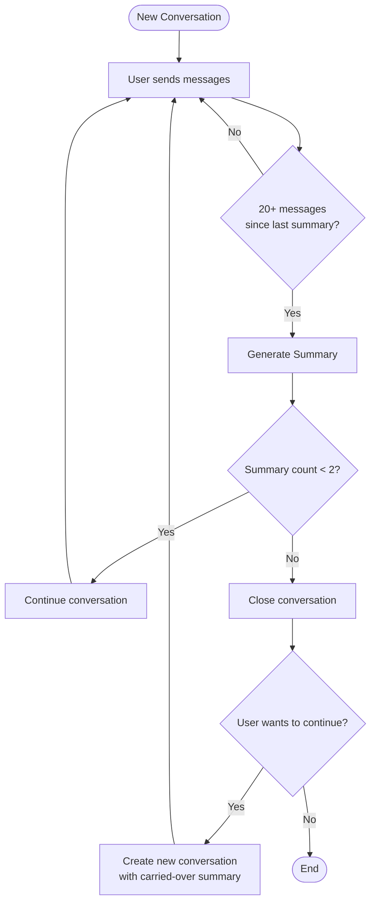

# AI Features

This document covers all AI-powered features in the Command Centre API, including chat modes, tools, charting, and guardrails.

## Chat Modes

The API supports two distinct chat modes:

### Global Mode (Default)

Global mode is for general dashboard queries across all resources. It provides:

- Access to all available Paystack tools
- General conversation about dashboard, transactions, customers, refunds, payouts, and disputes
- Broad context understanding across the merchant's entire account

**Example Request:**

```json
{
  "conversationId": "550e8400-e29b-41d4-a716-446655440000",
  "mode": "global",
  "message": {
    "role": "user",
    "parts": [{ "type": "text", "text": "What's my revenue today?" }]
  }
}
```

### Page-Scoped Mode

Page-scoped mode locks conversations to specific resources (transactions, customers, refunds, payouts, or disputes). It provides:

- **Context-aware responses**: AI knows the specific resource being discussed
- **Automatic resource enrichment**: Fetches and formats resource data for enhanced understanding
- **Filtered tools**: Only tools relevant to the resource type are available
- **Out-of-page-scope protection**: Refuses queries unrelated to the specific resource
- **Persistent context**: Conversations remain locked to the same resource

**Example Request:**

```json
{
  "conversationId": "550e8400-e29b-41d4-a716-446655440000",
  "mode": "page",
  "pageContext": {
    "type": "transaction",
    "resourceId": "123456"
  },
  "message": {
    "role": "user",
    "parts": [{ "type": "text", "text": "What's the status of this transaction?" }]
  }
}
```

## Paystack Tools

The assistant can only operate on merchant data exposed by these tools (all requests reuse the caller's JWT):

### Data Retrieval Tools

| Tool                | Description                    | Key Filters                                       |
| ------------------- | ------------------------------ | ------------------------------------------------- |
| `getTransactions`   | Fetch payment transactions     | status, channel, customer, date, amount, currency |
| `getCustomers`      | List/search customers          | email, account_number, pagination                 |
| `getRefunds`        | Fetch refund data              | status, date, amount (with operators: gt, lt, eq) |
| `getPayouts`        | Fetch payout/settlement data   | status, date, subaccount                          |
| `getDisputes`       | Fetch dispute data             | status, date, transaction, category               |
| `generateChartData` | Generate chart-ready analytics | resourceType, aggregationType, date range         |

### Data Export Tools

| Tool                 | Description                                           | Key Filters                                       | Delivery Method    |
| -------------------- | ----------------------------------------------------- | ------------------------------------------------- | ------------------ |
| `exportTransactions` | Export transaction data to email                      | status, channel, customer, date, amount, currency | Email              |
| `exportRefunds`      | Export refund data to email                           | status, date, search                              | Email              |
| `exportPayouts`      | Export payout data and receive immediate download URL | status, date, subaccount                          | S3 URL (immediate) |
| `exportDisputes`     | Export dispute data to email                          | status, date, transaction, category               | Email              |

**Export Features:**

- Email exports are sent to the authenticated user's email address
- Payout exports return an S3 download URL immediately (no email)
- All export tools validate data exists before triggering export
- Support similar filters as their corresponding GET tools
- Subject to the same 30-day date range limitation

**Important**: All date filters are limited to 30 days; helper validation returns clear errors when exceeded.

### Resource-Specific Tool Filtering

In page-scoped mode, tools are automatically filtered based on the resource type:

| Resource Type   | Available Tools                                       |
| --------------- | ----------------------------------------------------- |
| **Transaction** | `getCustomers`, `getRefunds`, `getDisputes`           |
| **Customer**    | `getTransactions`, `getRefunds`, `exportTransactions` |
| **Refund**      | `getTransactions`, `getCustomers`                     |
| **Payout**      | `getTransactions`                                     |
| **Dispute**     | `getTransactions`, `getCustomers`, `getRefunds`       |

This filtering ensures the AI only suggests actions that make sense in the current context.

## Charting & Aggregation

The `generateChartData` tool provides powerful analytics capabilities across multiple resource types.

### Supported Resource Types & Aggregations

| Resource        | Available Aggregations                                                            |
| --------------- | --------------------------------------------------------------------------------- |
| **Transaction** | by-day, by-hour, by-week, by-month, by-status                                     |
| **Refund**      | by-day, by-hour, by-week, by-month, by-status, **by-type** (full/partial)         |
| **Payout**      | by-day, by-hour, by-week, by-month, by-status                                     |
| **Dispute**     | by-day, by-hour, by-week, by-month, by-status, **by-category**, **by-resolution** |

### Aggregation Types

| Type            | Description                                          | Output         |
| --------------- | ---------------------------------------------------- | -------------- |
| `by-day`        | Daily trends with day names (e.g., "Monday, Nov 25") | Area chart     |
| `by-hour`       | Hourly patterns (00:00 - 23:00 UTC)                  | Bar chart      |
| `by-week`       | Weekly overview (ISO week format: YYYY-Www)          | Area chart     |
| `by-month`      | Monthly trends (YYYY-MM)                             | Area chart     |
| `by-status`     | Status distribution                                  | Doughnut chart |
| `by-type`       | Refund type breakdown (full/partial)                 | Doughnut chart |
| `by-category`   | Dispute category (fraud/chargeback)                  | Doughnut chart |
| `by-resolution` | Dispute resolution outcomes                          | Doughnut chart |

### Output Format (Recharts-compatible)

**Time-based aggregations** return per-currency series:

```json
{
  "success": true,
  "label": "Daily Transaction Metrics (Dec 1, 2024 - Dec 15, 2024)",
  "chartType": "area",
  "chartSeries": [
    {
      "currency": "NGN",
      "points": [{ "name": "Monday, Dec 1", "count": 45, "volume": 2500000, "average": 55555, "currency": "NGN" }]
    }
  ],
  "summary": {
    "totalCount": 450,
    "totalVolume": 25000000,
    "overallAverage": 55555,
    "perCurrency": [
      { "currency": "NGN", "totalCount": 400, "totalVolume": 20000000, "overallAverage": 50000 },
      { "currency": "USD", "totalCount": 50, "totalVolume": 5000000, "overallAverage": 100000 }
    ],
    "dateRange": { "from": "Dec 1, 2024", "to": "Dec 15, 2024" }
  }
}
```

**Categorical aggregations** return flat chart data:

```json
{
  "chartType": "doughnut",
  "chartData": [
    { "name": "success", "count": 400, "volume": 20000000, "average": 50000, "currency": "NGN" },
    { "name": "failed", "count": 50, "volume": 0, "average": 0, "currency": "NGN" }
  ]
}
```

### Chart Features

- Streams progress updates while fetching data (up to 1,000 records across 10 pages)
- Multi-currency support with per-currency series and breakdowns
- Automatic chart type suggestion based on aggregation
- Comprehensive summary statistics with per-currency breakdown
- Date range validation (30-day maximum)
- Resource-specific validation of aggregation types

## Guardrails & Classification

The system employs a dual-layer classification mechanism using GPT-4o-mini:

### Out-of-Scope Protection (Global)

Classifier ensures conversations stay within allowed intents:

- Dashboard insights
- Paystack product FAQs
- Account help
- Assistant capabilities

Out-of-scope requests (e.g., general knowledge, unrelated topics) receive a polite refusal:

> "I can only help with questions about your Paystack merchant dashboard (transactions, refunds, customers, disputes, payouts) and Paystack product usage. Ask me something like 'What's my revenue today?'"

### Out-of-Page-Scope Protection (Page Mode)

Additional classification layer for resource-scoped conversations:

- Ensures questions are relevant to the specific resource being viewed
- Prevents context confusion across different resource types

Refusal message:

> "I can only help with questions about this specific {resource_type}. Ask me something like 'What's the status of this {resource_type}?'"

### Additional Classification Features

- System prompt includes current date for accurate relative time understanding
- Classification considers full conversation history for context
- Graceful error handling with helpful suggestions for reformulating queries

## Resource Context Enrichment

When using page-scoped mode, the system automatically enriches conversations with resource-specific data.

### How It Works

1. **Resource Fetching**: `PageContextService` fetches the specific resource data from Paystack API
2. **Data Formatting**: Resource data is formatted into a human-readable structure
3. **Prompt Injection**: Formatted data is injected into the system prompt for AI context
4. **Enhanced Understanding**: AI can answer questions about the specific resource with full context

### Supported Resources

| Resource         | Data Fields                                                                                   |
| ---------------- | --------------------------------------------------------------------------------------------- |
| **Transactions** | ID, reference, amount, status, channel, customer details, payment info, currency              |
| **Customers**    | ID, customer code, email, name, phone, risk action, saved cards                               |
| **Refunds**      | ID, amount, status, transaction reference, refund type (full/partial), notes, currency        |
| **Payouts**      | ID, total amount, effective amount, status, settlement date, fees, currency                   |
| **Disputes**     | ID, refund amount, status, resolution, category (fraud/chargeback), due date, notes, currency |

### Example Context

When viewing transaction ID `123456`, the AI receives formatted context like:

```md
Transaction Details:

- ID: 123456
- Reference: ref_abc123xyz
- Amount: NGN 50000
- Status: success
- Channel: card
- Customer Email: customer@example.com
- Created At: 2024-12-15T10:30:00Z
```

## Automatic Title Generation

When a new conversation starts, the system automatically generates a descriptive title using GPT-3.5-turbo:

```typescript
import { generateConversationTitle } from './common/ai';

const title = await generateConversationTitle(message);
// Example output: "Payment API Integration"
// Example output: "Transaction Status Inquiry"
```

### Title Generation Features

- Runs asynchronously during the first streaming request
- Uses GPT-3.5-turbo for fast, cost-effective generation
- Extracts key topics from the first user message
- Generates concise, descriptive titles (typically 3-6 words)
- Falls back gracefully if generation fails

## Message Summarization

The system automatically summarizes long conversations to maintain context while managing token limits and conversation length.

### How It Works

1. **Threshold Monitoring**: After a configurable number of user messages (default: 20), summarization is triggered
2. **Summary Generation**: GPT-4o-mini generates a comprehensive summary of the conversation
3. **Context Preservation**: Key information, transaction IDs, customer details, and decisions are preserved
4. **Incremental Updates**: Subsequent summaries incorporate previous summaries for continuity
5. **Conversation Closure**: After reaching the maximum number of summaries (default: 2), the conversation is closed

### Configuration

```env
SUMMARIZATION_THRESHOLD=20  # User messages before triggering summarization (default: 20)
MAX_SUMMARIES=2             # Maximum summaries before conversation closes (default: 2)
```

### Conversation Lifecycle



### Summary Content

Summaries include:

- Main topics and user intents discussed
- Important data points: transaction IDs, customer information, reference codes, dates, amounts
- Key findings, insights, or recommendations provided
- Recurring themes or patterns identified

### Continuing Closed Conversations

When a conversation is closed (after 2 summaries), users can continue with a new conversation that carries over the context:

```http
POST /chat/conversations/from-summary
```

```json
{
  "previousConversationId": "550e8400-e29b-41d4-a716-446655440000",
  "mode": "global"
}
```

The new conversation inherits the combined summary from the closed conversation, allowing seamless continuation without losing context.

### Conversation Response Fields

| Field                     | Description                                            |
| ------------------------- | ------------------------------------------------------ |
| `summary`                 | Current conversation summary (if generated)            |
| `summaryCount`            | Number of summaries generated (0-2)                    |
| `previousSummary`         | Summary carried over from a previous conversation      |
| `lastSummarizedMessageId` | Watermark tracking last summarized message             |
| `isClosed`                | Whether the conversation is closed (after 2 summaries) |

## Chat Streaming

The API provides real-time AI chat capabilities with streaming responses using Server-Sent Events (SSE).

### Features

- Streams AI responses in real-time using UIMessageStream format
- Includes reasoning steps in the response
- Automatically generates conversation titles for new conversations
- Maintains conversation history context (last 40 messages by default)
- Supports AI tools for dynamic actions
- Dual-mode support: global or resource-scoped
- **Automatic summarization** for long conversations with context carry-over

### Configuration

```env
MESSAGE_HISTORY_LIMIT=40    # Number of past messages kept in AI context
SUMMARIZATION_THRESHOLD=20  # User messages before triggering summarization
MAX_SUMMARIES=2             # Maximum summaries before conversation closes
```
