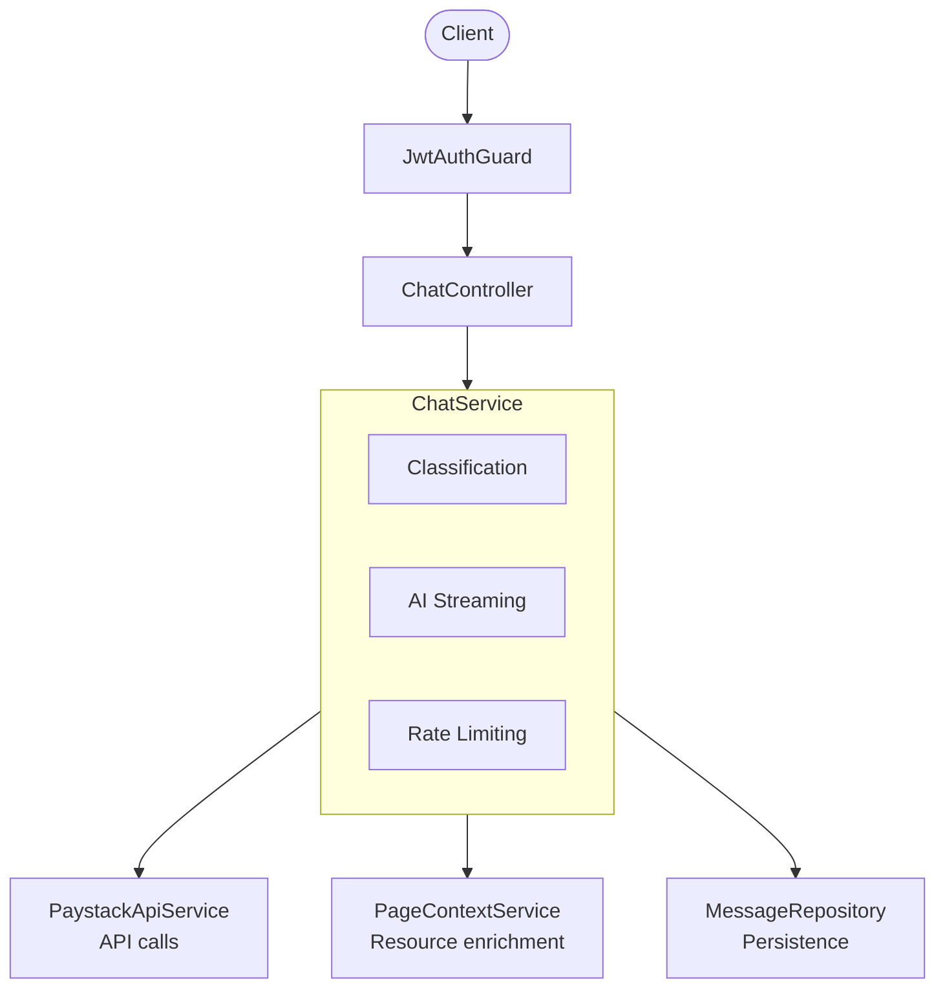
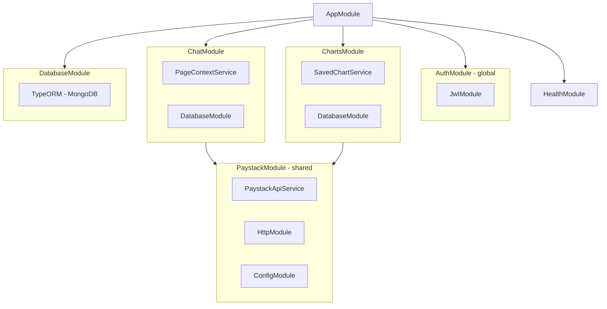

# Architecture

This document describes the architecture, core services, and technology stack of the Command Centre API.

## Core Services

The application is built around several key services that work together:

### ChatService

Orchestrates the entire conversation flow:

- **Conversation Management**: CRUD operations for conversations and messages
- **Message Streaming**: Handles AI-powered streaming responses with automatic stream consumption
- **Rate Limiting**: Enforces user entitlement with sliding window enforcement
- **Message Classification**: Dual-layer classification for out-of-scope protection
- **Conversation History**: Manages message history with configurable limits and summarization
- **Chat Modes**: Supports both global and page-scoped conversation modes with validation
- **Mode Validation**: Ensures conversation mode consistency with `validateChatMode()`
- **Message Validation**: Validates UI messages against tool schemas with `validateMessages()`
- **Closed Conversations**: Gracefully handles attempts to message closed conversations
- **System Prompts**: Generates mode-specific system prompts and tool sets with `getSystemPromptAndTools()`
- **Message Building**: Constructs LLM-ready message history with summary support via `buildMessagesForLLM()`
- **Smart Summarization**: Tracks summarization progress with `lastSummarizedMessageId` to avoid reprocessing
- **TTL Management**: Manages data retention with automatic expiry window refresh via `calculateExpiry()` and `refreshExpiryWindow()`

### PaystackModule

Shared module that provides PaystackApiService across the application:

- **Single Instance**: Ensures one PaystackApiService instance across all modules
- **Encapsulates Dependencies**: Bundles ConfigModule and HttpModule
- **Prevents Duplication**: Avoids duplicate providers with separate HTTP/Config instances
- **Exports**: PaystackApiService for use in importing modules

### PaystackApiService

Provides authenticated access to Paystack APIs:

- JWT-passthrough authentication (reuses user's token)
- GET and POST request support
- Standardized error handling with `PaystackError`
- Configurable base URL for different environments
- Automatic response transformation

### PageContextService

Enriches page-scoped conversations with resource data:

- Fetches resource details from Paystack API
- Formats resource data for AI prompt injection
- Supports all resource types (transactions, customers, refunds, payouts, disputes)
- Provides structured context for better AI understanding
- Handles resource not found errors gracefully

### AuthService

Manages JWT authentication:

- Token validation and verification
- User ID extraction from token claims
- Integration with NestJS guard system
- Configurable token expiration

### SavedChartService

Manages saved chart configurations and regeneration:

- Saves chart configurations with custom names and descriptions
- Retrieves saved charts for authenticated users
- Regenerates charts with fresh data from Paystack API
- Updates chart metadata (name, description)
- Deletes saved charts with ownership verification
- Validates chart configurations (aggregation types, date ranges)
- Integrates with CacheService for performance optimization

### CacheService

Provides Redis-based caching for performance optimization across the application:

- **Shared Service**: Located in `src/common/services/cache.service.ts` for app-wide usage
- **Safe Operations**: All cache operations (get/set) wrapped with error handling and graceful degradation
- **Default TTL**: 24-hour default TTL for cached data (configurable per operation)
- **Error Resilience**: Cache failures logged but don't interrupt application flow
- **Used By**: SavedChartService (chart data caching), Feature State tool (integration data caching)
- **Cache Key Generation**: Services build deterministic cache keys for consistent lookups
- **Configuration-Based Caching**: Cache keys include relevant identifiers (user ID, resource ID, config hash)

### Feature State System

Provides intelligent dashboard feature discovery and state inspection via AI tools:

- **Feature Resolution**: BM25-based search resolves natural language queries to specific features (e.g., "transfer approval" → `transfer-approval`)
- **State Evaluation**: JSON logic runner evaluates feature state rules against merchant integration data
- **Knowledge Base**: Versioned feature map ontology defines features, fields, and state rules
- **Template Interpolation**: Dynamic detail messages with data interpolation (e.g., "min amount {{transfer_approval.min_amount}}")
- **Integration Caching**: Caches integration API responses to reduce redundant calls
- **RAG Ready**: Placeholder for future RAG integration for feature descriptions
- **Provenance Tracking**: Returns matched rule ID, ontology version, and data freshness

**Key Components:**

- `src/common/ai/tools/feature-state.ts` - AI tool for querying feature states
- `src/common/ai/knowledge/feature-map.ts` - Versioned feature ontology with state rules
- `src/common/ai/search/feature-bm25.ts` - BM25 resolver for feature matching
- `src/common/ai/logic/json-logic-runner.ts` - Expression evaluator for state rules
- `src/common/ai/utils/interpolate.ts` - Template interpolation utility
- `src/common/ai/types/feature.ts` - Type definitions for features and states

**How It Works:**

1. User queries about a feature (e.g., "What's my transfer approval setting?")
2. BM25 resolver matches query to feature slug using indexed terms (slug, name, synonyms, dashboard_path)
3. System fetches integration data from Paystack API (cached for 24 hours)
4. JSON logic runner evaluates state rules against integration payload
5. Template engine interpolates dynamic values into detail messages
6. Returns feature state, dashboard path, description (via RAG placeholder), and provenance

**Example Feature State Response:**

```json
{
  "success": true,
  "feature": {
    "slug": "transfer-approval",
    "name": "Transfer Approval",
    "dashboard_path": "/dashboard/transfers/approvals"
  },
  "state": {
    "state": "enabled",
    "details": "Dual approval required for transfers; min amount 100000.",
    "ruleId": "dual-on",
    "dataAgeSeconds": 120
  },
  "description": "Description for support:transfer-approval (stub).",
  "provenance": {
    "ontologyVersion": "0.1.0",
    "ruleEngine": "expression",
    "matchedRule": "dual-on"
  }
}
```

### Telemetry Module

Provides comprehensive LLM observability through Langfuse integration:

- **Trace Management**: Creates parent traces for each chat interaction
- **Context Tracking**: Captures conversation ID, user ID, mode, and page context
- **Metadata Enrichment**: Tags traces with service, environment, operation type
- **Session Grouping**: Groups all operations in a conversation under one session
- **Langfuse Client**: Singleton client for direct SDK access
- **Span Processing**: Custom OpenTelemetry span processor with automatic metadata filtering
- **Metadata Filtering**: Removes verbose resource attributes and tools arrays (30-50% size reduction)
- **Input/Output Capture**: Records user messages and assistant responses
- **Token Usage Tracking**: Monitors LLM token consumption and costs

**Key Files:**

- `src/common/ai/observability/telemetry.ts` - Telemetry context and trace creation
- `src/common/ai/observability/langfuse.config.ts` - Langfuse span processor configuration
- `src/common/ai/observability/filtering-span-processor.ts` - Metadata filtering span processor
- `src/common/ai/observability/attribute-filters.ts` - Attribute filtering utilities

### Response Sanitization System

Optimizes token consumption by filtering tool responses before sending to LLM:

- **Automatic Filtering**: All data retrieval tools automatically sanitize responses
- **Configuration-Driven**: Field configurations define what to keep at each sanitization level
- **Three Levels**: MINIMAL (85-87% reduction), STANDARD (70-75%, default), DETAILED (60-65%)
- **Nested Object Handling**: Intelligently filters nested objects and limits arrays
- **Type Safety**: Full TypeScript support with generic types
- **Extensible**: Easy to add new resource types with field configurations
- **Impact**: 2.5x more tool calls before summarization, longer coherent conversations

**Sanitization Levels:**

- **MINIMAL**: Only critical identification fields (IDs, amounts, status)
- **STANDARD** (default): Common fields for general queries (references, dates, core metrics, basic nested objects)
- **DETAILED**: Extended fields for complex analysis (notes, metadata, detailed nested objects)

**Token Savings (STANDARD level):**

- Transactions: ~75% reduction (removes log, metadata, verbose authorization details)
- Customers: ~62% reduction (limits authorization arrays, removes internal metadata)
- Refunds: ~71% reduction (removes internal processing details)
- Payouts: ~57% reduction (simplifies subaccount fields)
- Disputes: ~75% reduction (limits message/history arrays)

**Key Files:**

- `src/common/ai/sanitization/config.ts` - Field configurations per resource type
- `src/common/ai/sanitization/sanitizer.ts` - Core filtering engine with ResourceSanitizer class
- `src/common/ai/sanitization/types.ts` - Type definitions and enums
- Applied automatically in `src/common/ai/tools/retrieval.ts`

## Project Structure

```md
src/
├── common/
│ ├── ai/ # AI utilities and integrations
│ │ ├── actions.ts # AI action functions (title generation, classification)
│ │ ├── policy.ts # Classification policy and refusal messages
│ │ ├── prompts.ts # AI system prompts (global & page-scoped)
│ │ ├── utilities/ # Chart and data processing utilities
│ │ │ ├── aggregation.ts # Chart data aggregation logic
│ │ │ ├── chart-config.ts # Resource-specific chart configuration
│ │ │ ├── chart-generator.ts # Chart generation orchestration
│ │ │ ├── chart-validation.ts # Chart parameter validation
│ │ │ └── utils.ts # Helper functions for AI (date validation, conversions)
│ │ ├── observability/ # LLM observability
│ │ │ ├── telemetry.ts # Trace management and telemetry context
│ │ │ ├── langfuse.config.ts # Langfuse span processor configuration
│ │ │ ├── filtering-span-processor.ts # Metadata filtering span processor
│ │ │ ├── attribute-filters.ts # Attribute filtering utilities
│ │ │ └── instrumentation.ts # OpenTelemetry SDK initialization
│ │ ├── tools/ # AI tools (organized by category)
│ │ │ ├── index.ts # Main tool exports & page-scoped filtering
│ │ │ ├── retrieval.ts # Data retrieval tools (get*)
│ │ │ ├── export.ts # Data export tools (export*)
│ │ │ ├── visualization.ts # Chart generation tools
│ │ │ ├── feature-state.ts # Feature state inspection tool
│ │ │ ├── export-tools.spec.ts # Export tools tests
│ │ │ ├── retrieval-tools.spec.ts # Retrieval tools tests
│ │ │ ├── feature-state.spec.ts # Feature state tool tests
│ │ │ └── page-scoped-tools.spec.ts # Page-scoped filtering tests
│ │ ├── sanitization/ # Response sanitization for token efficiency
│ │ │ ├── index.ts # Public API exports
│ │ │ ├── types.ts # Sanitization types and enums
│ │ │ ├── config.ts # Field configurations per resource type
│ │ │ ├── sanitizer.ts # Core sanitization engine
│ │ │ └── sanitizer.spec.ts # Sanitization tests
│ │ ├── knowledge/ # Feature knowledge base
│ │ │ └── feature-map.ts # Versioned feature ontology
│ │ ├── logic/ # Rule evaluation engines
│ │ │ └── json-logic-runner.ts # Expression evaluator for feature rules
│ │ ├── search/ # Search and matching algorithms
│ │ │ └── feature-bm25.ts # BM25 resolver for feature matching
│ │ ├── utils/ # AI utility functions
│ │ │ └── interpolate.ts # Template interpolation utility
│ │ ├── types/ # TypeScript types for Paystack resources
│ │ │ ├── index.ts # Main type exports
│ │ │ ├── data.ts # Enums and data types
│ │ │ └── feature.ts # Feature state types
│ │ └── index.ts
│ ├── exceptions/ # Custom exceptions and global filters
│ ├── helpers/ # Shared utilities
│ ├── interfaces/ # Common interfaces
│ └── services/
│ ├── paystack-api.service.ts # Paystack API integration
│ ├── paystack.module.ts # Shared Paystack module
│ ├── page-context.service.ts # Resource enrichment service
│ └── cache.service.ts # Redis caching service
├── config/ # Configuration modules
│ ├── database.config.ts
│ ├── cache.config.ts # Redis cache configuration
│ ├── jwt.config.ts
│ └── helpers.ts
├── database/
│ ├── migrations/ # TypeORM migrations
│ └── database.module.ts
├── modules/
│ ├── auth/ # JWT authentication module
│ │ ├── guards/ # JWT auth guard
│ │ ├── decorators/ # @CurrentUser() decorator
│ │ └── auth.service.ts
│ ├── chat/ # Chat & conversation module
│ │ ├── dto/ # Data transfer objects
│ │ │ ├── chat-request.dto.ts # Includes mode & pageContext
│ │ │ ├── page-context.dto.ts # PageContext validation
│ │ │ └── ...
│ │ ├── entities/ # TypeORM entities
│ │ │ ├── conversation.entity.ts
│ │ │ └── message.entity.ts
│ │ ├── repositories/ # Database repositories
│ │ ├── exceptions/ # Rate limiting exception
│ │ ├── chat.controller.ts
│ │ ├── chat.service.ts # Orchestrates AI, tools, and classification
│ │ └── chat.module.ts
│ ├── charts/ # Saved charts module
│ │ ├── dto/ # Data transfer objects
│ │ │ ├── save-chart.dto.ts # Chart creation with channel filter support
│ │ │ ├── update-chart.dto.ts # Chart metadata updates
│ │ │ ├── chart-config.dto.ts # Chart generation config
│ │ │ ├── regenerate-chart-query.dto.ts # Query override parameters
│ │ │ ├── saved-chart-response.dto.ts # Response format
│ │ │ └── saved-chart-with-data-response.dto.ts # With regenerated data
│ │ ├── entities/ # TypeORM entities
│ │ │ └── saved-chart.entity.ts
│ │ ├── repositories/ # Database repositories
│ │ │ └── saved-chart.repository.ts
│ │ ├── saved-charts.controller.ts
│ │ ├── saved-chart.service.ts # Chart CRUD and regeneration
│ │ └── charts.module.ts
│ └── health/ # Health check endpoints
├── app.module.ts # Root module with global auth guard
└── main.ts # Application entry point with observability
```

## Technology Stack

| Category              | Technology                              | Version      |
| --------------------- | --------------------------------------- | ------------ |
| **Framework**         | NestJS                                  | v11          |
| **Database**          | MongoDB with TypeORM                    | v6.8 / v0.3  |
| **Cache**             | Redis with @keyv/redis & cache-manager  | v7.2         |
| **AI SDK**            | Vercel AI SDK with OpenAI               | v5.0.110     |
| **Language**          | TypeScript                              | v5.7         |
| **Validation**        | class-validator, class-transformer, Zod | v4.0         |
| **HTTP Client**       | Axios via @nestjs/axios                 | v1.6         |
| **Date Utilities**    | date-fns                                | v4.1         |
| **Documentation**     | Swagger/OpenAPI (@nestjs/swagger)       | v11          |
| **Observability**     | @paystackhq/nestjs-observability        | v1.2         |
| **LLM Observability** | Langfuse SDK & @langfuse/otel           | v3.38 / v4.5 |
| **Error Handling**    | @paystackhq/pkg-response-code           | v3.0         |
| **Build Tool**        | SWC                                     | v1.10        |

### AI Models

- **GPT-4o-mini**: Chat responses and message classification
- **GPT-3.5-turbo**: Conversation title generation

## Shared Module Pattern

The application uses NestJS shared modules for cross-cutting concerns:

### PaystackModule (Shared)

The `PaystackModule` is a shared module that:

- **Centralizes** Paystack API access across multiple modules
- **Prevents** duplicate HTTP and Config module instances
- **Ensures** a single PaystackApiService instance app-wide
- **Imported by**: ChatModule, ChartsModule

This pattern avoids common pitfalls like:

- Multiple HTTP client instances with different configurations
- Inconsistent error handling across modules
- Configuration drift between similar services

## Request Flow



## Module Dependencies


