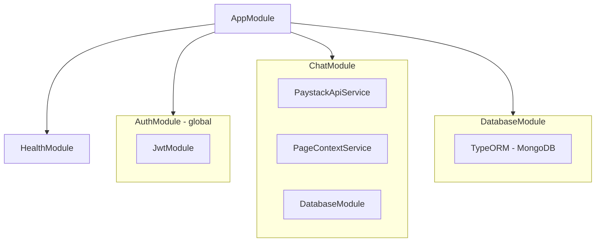

# Architecture

This document describes the architecture, core services, and technology stack of the Command Centre API.

## Core Services

The application is built around several key services that work together:

### ChatService

Orchestrates the entire conversation flow:

- Manages conversation CRUD operations
- Handles message streaming with AI
- Enforces rate limiting and user entitlement
- Coordinates message classification
- Manages conversation history with configurable limits
- Handles both global and page-scoped conversation modes

### PaystackApiService

Provides authenticated access to Paystack APIs:

- JWT-passthrough authentication (reuses user's token)
- GET and POST request support
- Standardized error handling with `PaystackError`
- Configurable base URL for different environments
- Automatic response transformation

### PageContextService

Enriches page-scoped conversations with resource data:

- Fetches resource details from Paystack API
- Formats resource data for AI prompt injection
- Supports all resource types (transactions, customers, refunds, payouts, disputes)
- Provides structured context for better AI understanding
- Handles resource not found errors gracefully

### AuthService

Manages JWT authentication:

- Token validation and verification
- User ID extraction from token claims
- Integration with NestJS guard system
- Configurable token expiration

## Project Structure

```md
src/
├── common/
│ ├── ai/ # AI utilities and integrations
│ │ ├── actions.ts # AI action functions (title generation, classification)
│ │ ├── aggregation.ts # Chart data aggregation logic
│ │ ├── chart-config.ts # Resource-specific chart configuration
│ │ ├── policy.ts # Classification policy and refusal messages
│ │ ├── prompts.ts # AI system prompts (global & page-scoped)
│ │ ├── utils.ts # Helper functions for AI (date validation, conversions)
│ │ ├── tools/ # AI tools (organized by category)
│ │ │ ├── index.ts # Main tool exports & page-scoped filtering
│ │ │ ├── retrieval.ts # Data retrieval tools (get*)
│ │ │ ├── export.ts # Data export tools (export*)
│ │ │ ├── visualization.ts # Chart generation tools
│ │ │ ├── export-tools.spec.ts # Export tools tests
│ │ │ ├── retrieval-tools.spec.ts # Retrieval tools tests
│ │ │ └── page-scoped-tools.spec.ts # Page-scoped filtering tests
│ │ ├── types/ # TypeScript types for Paystack resources
│ │ │ ├── index.ts # Main type exports
│ │ │ └── data.ts # Enums and data types
│ │ └── index.ts
│ ├── exceptions/ # Custom exceptions and global filters
│ ├── helpers/ # Shared utilities
│ ├── interfaces/ # Common interfaces
│ └── services/
│ ├── paystack-api.service.ts # Paystack API integration
│ └── page-context.service.ts # Resource enrichment service
├── config/ # Configuration modules
│ ├── database.config.ts
│ ├── jwt.config.ts
│ └── helpers.ts
├── database/
│ ├── migrations/ # TypeORM migrations
│ └── database.module.ts
├── modules/
│ ├── auth/ # JWT authentication module
│ │ ├── guards/ # JWT auth guard
│ │ ├── decorators/ # @CurrentUser() decorator
│ │ └── auth.service.ts
│ ├── chat/ # Chat & conversation module
│ │ ├── dto/ # Data transfer objects
│ │ │ ├── chat-request.dto.ts # Includes mode & pageContext
│ │ │ ├── page-context.dto.ts # PageContext validation
│ │ │ └── ...
│ │ ├── entities/ # TypeORM entities
│ │ │ ├── conversation.entity.ts
│ │ │ └── message.entity.ts
│ │ ├── repositories/ # Database repositories
│ │ ├── exceptions/ # Rate limiting exception
│ │ ├── chat.controller.ts
│ │ ├── chat.service.ts # Orchestrates AI, tools, and classification
│ │ └── chat.module.ts
│ └── health/ # Health check endpoints
├── app.module.ts # Root module with global auth guard
└── main.ts # Application entry point with observability
```

## Technology Stack

| Category           | Technology                              | Version     |
| ------------------ | --------------------------------------- | ----------- |
| **Framework**      | NestJS                                  | v11         |
| **Database**       | MongoDB with TypeORM                    | v6.8 / v0.3 |
| **AI SDK**         | Vercel AI SDK with OpenAI               | v5.0.110    |
| **Language**       | TypeScript                              | v5.7        |
| **Validation**     | class-validator, class-transformer, Zod | v4.0        |
| **HTTP Client**    | Axios via @nestjs/axios                 | v1.6        |
| **Date Utilities** | date-fns                                | v4.1        |
| **Documentation**  | Swagger/OpenAPI (@nestjs/swagger)       | v11         |
| **Observability**  | @paystackhq/nestjs-observability        | v1.2        |
| **Error Handling** | @paystackhq/pkg-response-code           | v3.0        |
| **Build Tool**     | SWC                                     | v1.10       |

### AI Models

- **GPT-4o-mini**: Chat responses and message classification
- **GPT-3.5-turbo**: Conversation title generation

## Request Flow


## Module Dependencies


