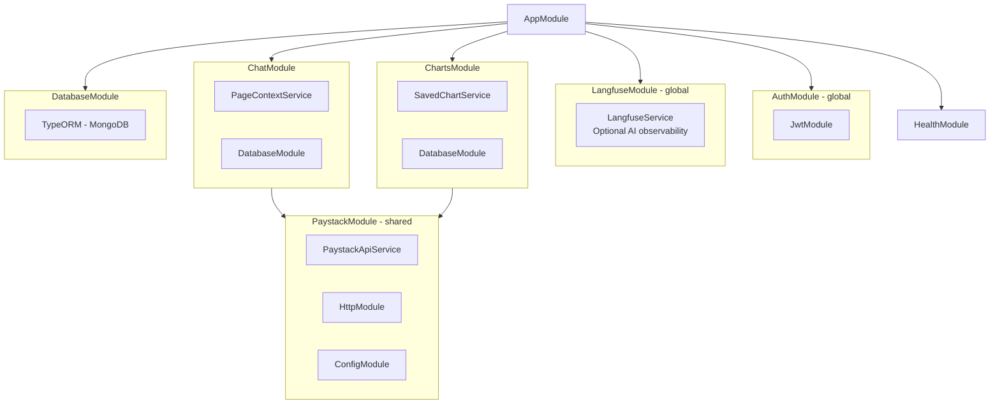

# Architecture

This document describes the architecture, core services, and technology stack of the Command Centre API.

## Core Services

The application is built around several key services that work together:

### ChatService

Orchestrates the entire conversation flow:

- **Conversation Management**: CRUD operations for conversations and messages
- **Message Streaming**: Handles AI-powered streaming responses with automatic stream consumption
- **Rate Limiting**: Enforces user entitlement with sliding window enforcement
- **Message Classification**: Dual-layer classification for out-of-scope protection
- **Conversation History**: Manages message history with configurable limits and summarization
- **Chat Modes**: Supports both global and page-scoped conversation modes with validation
- **Mode Validation**: Ensures conversation mode consistency with `validateChatMode()`
- **Message Validation**: Validates UI messages against tool schemas with `validateMessages()`
- **Closed Conversations**: Gracefully handles attempts to message closed conversations
- **System Prompts**: Generates mode-specific system prompts and tool sets with `getSystemPromptAndTools()`
- **Message Building**: Constructs LLM-ready message history with summary support via `buildMessagesForLLM()`
- **Smart Summarization**: Tracks summarization progress with `lastSummarizedMessageId` to avoid reprocessing
- **TTL Management**: Manages data retention with automatic expiry window refresh via `calculateExpiry()` and `refreshExpiryWindow()`

### PaystackModule

Shared module that provides PaystackApiService across the application:

- **Single Instance**: Ensures one PaystackApiService instance across all modules
- **Encapsulates Dependencies**: Bundles ConfigModule and HttpModule
- **Prevents Duplication**: Avoids duplicate providers with separate HTTP/Config instances
- **Exports**: PaystackApiService for use in importing modules

### PaystackApiService

Provides authenticated access to Paystack APIs:

- JWT-passthrough authentication (reuses user's token)
- GET and POST request support
- Standardized error handling with `PaystackError`
- Configurable base URL for different environments
- Automatic response transformation

### PageContextService

Enriches page-scoped conversations with resource data:

- Fetches resource details from Paystack API
- Formats resource data for AI prompt injection
- Supports all resource types (transactions, customers, refunds, payouts, disputes)
- Provides structured context for better AI understanding
- Handles resource not found errors gracefully

### AuthService

Manages JWT authentication:

- Token validation and verification
- User ID extraction from token claims
- Integration with NestJS guard system
- Configurable token expiration

### SavedChartService

Manages saved chart configurations and regeneration:

- Saves chart configurations with custom names and descriptions
- Retrieves saved charts for authenticated users
- Regenerates charts with fresh data from Paystack API
- Updates chart metadata (name, description)
- Deletes saved charts with ownership verification
- Validates chart configurations (aggregation types, date ranges)

### LangfuseService

Provides AI observability with graceful degradation:

- **Optional Integration**: App works normally without Langfuse configured
- **Trace Management**: Creates traces linked to conversations with user session tracking
- **Configuration Validation**: Validates credentials and supports cloud (EU/US) and self-hosted instances
- **Graceful Degradation**: Returns null/no-op when disabled or credentials missing
- **Lifecycle Management**: Automatic flush and shutdown via `onModuleDestroy()`
- **Error Handling**: All operations wrapped in try-catch with error logging
- **Health Check**: `/health/langfuse` endpoint for operational monitoring
- **Sampling Support**: Configurable sampling rate for production cost control

**Hybrid Architecture**:

- **Primary**: OpenTelemetry Span Processor via Vercel AI SDK's `experimental_telemetry`
- **Secondary**: Explicit trace/session management via LangfuseService wrapper
- **Factory Pattern**: `createAITelemetryConfig()` helper for consistent telemetry configuration

**Instrumented Operations**:

- Chat streaming (gpt-4o-mini) - Includes conversation metadata, tool tracking
- Title generation (gpt-3.5-turbo) - Links to first message
- Conversation summarization - Tracks message count and summary progression
- Message classification - Includes page context awareness
- Tool execution - Automatic tracking via Vercel AI SDK

## Project Structure

```md
src/
├── common/
│ ├── ai/ # AI utilities and integrations
│ │ ├── actions.ts # AI action functions (title generation, classification)
│ │ ├── aggregation.ts # Chart data aggregation logic
│ │ ├── chart-config.ts # Resource-specific chart configuration
│ │ ├── policy.ts # Classification policy and refusal messages
│ │ ├── prompts.ts # AI system prompts (global & page-scoped)
│ │ ├── utils.ts # Helper functions for AI (date validation, conversions)
│ │ ├── tools/ # AI tools (organized by category)
│ │ │ ├── index.ts # Main tool exports & page-scoped filtering
│ │ │ ├── retrieval.ts # Data retrieval tools (get*)
│ │ │ ├── export.ts # Data export tools (export*)
│ │ │ ├── visualization.ts # Chart generation tools
│ │ │ ├── export-tools.spec.ts # Export tools tests
│ │ │ ├── retrieval-tools.spec.ts # Retrieval tools tests
│ │ │ └── page-scoped-tools.spec.ts # Page-scoped filtering tests
│ │ ├── types/ # TypeScript types for Paystack resources
│ │ │ ├── index.ts # Main type exports
│ │ │ └── data.ts # Enums and data types
│ │ └── index.ts
│ ├── observability/ # AI observability with Langfuse
│ │ ├── langfuse.module.ts # NestJS global module
│ │ ├── langfuse.service.ts # Core service with graceful degradation
│ │ ├── langfuse.config.ts # Config validation (cloud/self-hosted)
│ │ ├── langfuse.service.spec.ts # Comprehensive unit tests
│ │ └── utils/
│ │ └── ai-telemetry-config.ts # Helper for Vercel AI SDK telemetry
│ ├── exceptions/ # Custom exceptions and global filters
│ ├── helpers/ # Shared utilities
│ ├── interfaces/ # Common interfaces
│ └── services/
│ ├── paystack-api.service.ts # Paystack API integration
│ ├── paystack.module.ts # Shared Paystack module
│ └── page-context.service.ts # Resource enrichment service
├── config/ # Configuration modules
│ ├── database.config.ts
│ ├── jwt.config.ts
│ └── helpers.ts
├── database/
│ ├── migrations/ # TypeORM migrations
│ └── database.module.ts
├── modules/
│ ├── auth/ # JWT authentication module
│ │ ├── guards/ # JWT auth guard
│ │ ├── decorators/ # @CurrentUser() decorator
│ │ └── auth.service.ts
│ ├── chat/ # Chat & conversation module
│ │ ├── dto/ # Data transfer objects
│ │ │ ├── chat-request.dto.ts # Includes mode & pageContext
│ │ │ ├── page-context.dto.ts # PageContext validation
│ │ │ └── ...
│ │ ├── entities/ # TypeORM entities
│ │ │ ├── conversation.entity.ts
│ │ │ └── message.entity.ts
│ │ ├── repositories/ # Database repositories
│ │ ├── exceptions/ # Rate limiting exception
│ │ ├── chat.controller.ts
│ │ ├── chat.service.ts # Orchestrates AI, tools, and classification
│ │ └── chat.module.ts
│ ├── charts/ # Saved charts module
│ │ ├── dto/ # Data transfer objects
│ │ │ ├── save-chart.dto.ts # Chart creation
│ │ │ ├── update-chart.dto.ts # Chart metadata updates
│ │ │ ├── saved-chart-response.dto.ts # Response format
│ │ │ └── saved-chart-with-data-response.dto.ts # With regenerated data
│ │ ├── entities/ # TypeORM entities
│ │ │ └── saved-chart.entity.ts
│ │ ├── repositories/ # Database repositories
│ │ │ └── saved-chart.repository.ts
│ │ ├── charts.controller.ts
│ │ ├── saved-chart.service.ts # Chart CRUD and regeneration
│ │ └── charts.module.ts
│ └── health/ # Health check endpoints
├── app.module.ts # Root module with global auth guard
└── main.ts # Application entry point with observability
```

## Technology Stack

| Category             | Technology                                           | Version     |
| -------------------- | ---------------------------------------------------- | ----------- |
| **Framework**        | NestJS                                               | v11         |
| **Database**         | MongoDB with TypeORM                                 | v6.8 / v0.3 |
| **AI SDK**           | Vercel AI SDK with OpenAI                            | v5.0.110    |
| **Language**         | TypeScript                                           | v5.7        |
| **Validation**       | class-validator, class-transformer, Zod              | v4.0        |
| **HTTP Client**      | Axios via @nestjs/axios                              | v1.6        |
| **Date Utilities**   | date-fns                                             | v4.1        |
| **Documentation**    | Swagger/OpenAPI (@nestjs/swagger)                    | v11         |
| **Observability**    | @paystackhq/nestjs-observability                     | v1.2        |
| **AI Observability** | Langfuse (langfuse, langfuse-vercel, @langfuse/otel) | v3.38/v4.5  |
| **Error Handling**   | @paystackhq/pkg-response-code                        | v3.0        |
| **Build Tool**       | SWC                                                  | v1.10       |

### AI Models

- **GPT-4o-mini**: Chat responses and message classification
- **GPT-3.5-turbo**: Conversation title generation

## Shared Module Pattern

The application uses NestJS shared modules for cross-cutting concerns:

### PaystackModule (Shared)

The `PaystackModule` is a shared module that:

- **Centralizes** Paystack API access across multiple modules
- **Prevents** duplicate HTTP and Config module instances
- **Ensures** a single PaystackApiService instance app-wide
- **Imported by**: ChatModule, ChartsModule

This pattern avoids common pitfalls like:

- Multiple HTTP client instances with different configurations
- Inconsistent error handling across modules
- Configuration drift between similar services

### LangfuseModule (Global)

The `LangfuseModule` is a global module that:

- **Optional**: Can be disabled without affecting application functionality
- **Provides** LangfuseService across all modules without explicit imports
- **Integrates** with OpenTelemetry via LangfuseExporter span processor
- **Supports** both cloud (EU/US) and self-hosted Langfuse instances
- **Tracks** LLM calls, tool executions, user sessions, and conversation traces

## Request Flow


## Module Dependencies


