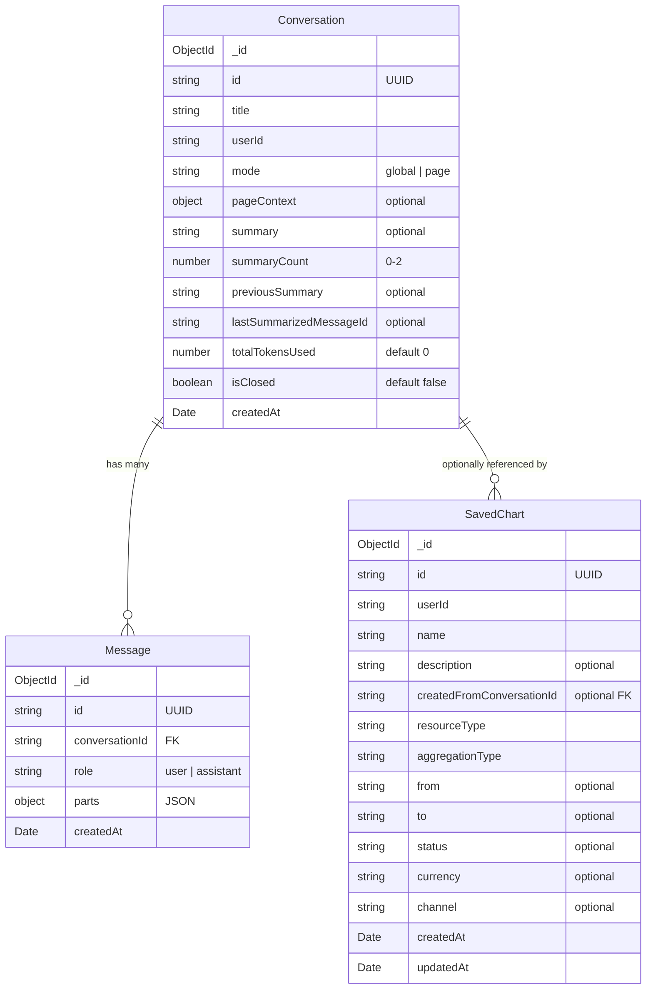

# Database

This document describes the MongoDB database schema and migration system.

## Overview

The application uses MongoDB with TypeORM for data persistence. The database stores conversations and messages for the AI chat functionality.

## Collections

### Conversations

Stores chat conversation metadata, context, and summarization state.

```typescript
{
  _id: ObjectId,
  id: string,                    // UUID
  title: string,
  userId: string,
  mode: 'global' | 'page',       // Chat mode
  pageContext: {                 // Optional, only for page-scoped conversations
    type: 'transaction' | 'customer' | 'refund' | 'payout' | 'dispute',
    resourceId: string
  },
  summary: string | null,        // Current conversation summary
  summaryCount: number,          // Number of summaries generated (0-2)
  previousSummary: string | null,// Summary carried over from previous conversation
  lastSummarizedMessageId: string | null, // Watermark for incremental summarization
  totalTokensUsed: number,       // Cumulative token usage since last summary (resets to 0 after each summary)
  isClosed: boolean,             // True after max summaries reached
  createdAt: Date
}
```

#### Fields

| Field                     | Type    | Default | Description                                                            |
| ------------------------- | ------- | ------- | ---------------------------------------------------------------------- |
| `id`                      | string  | -       | UUID (client-generated)                                                |
| `title`                   | string  | -       | Conversation title (auto-generated or custom)                          |
| `userId`                  | string  | -       | Owner user ID                                                          |
| `mode`                    | enum    | -       | Chat mode: `global` or `page`                                          |
| `pageContext`             | object  | null    | Resource context for page-scoped conversations                         |
| `summary`                 | string  | null    | AI-generated summary of conversation                                   |
| `summaryCount`            | number  | 0       | Count of summaries (conversation closes at 2)                          |
| `previousSummary`         | string  | null    | Summary inherited from a closed conversation                           |
| `lastSummarizedMessageId` | string  | null    | Last message ID included in summary (watermark)                        |
| `totalTokensUsed`         | number  | 0       | Cumulative token count since last summary (resets after summarization) |
| `isClosed`                | boolean | false   | Whether conversation is closed (no new messages)                       |
| `lastActivityAt`          | Date    | -       | Last activity timestamp (updated on each message)                      |
| `expiresAt`               | Date    | -       | Absolute expiry timestamp for TTL deletion                             |
| `createdAt`               | Date    | -       | Creation timestamp                                                     |

#### Indexes

| Index            | Type    | Purpose                       |
| ---------------- | ------- | ----------------------------- |
| `id`             | Unique  | UUID lookups                  |
| `userId`         | Regular | User-scoped queries           |
| `mode`           | Regular | Filtering by chat mode        |
| `lastActivityAt` | Regular | Activity tracking and sorting |
| `expiresAt`      | TTL     | Automatic document deletion   |

### Messages

Stores individual chat messages within conversations.

```typescript
{
  _id: ObjectId,
  id: string,                    // UUID (required, client-provided)
  conversationId: string,        // Reference to conversation
  role: 'user' | 'assistant',
  parts: {                       // Flexible JSON for multi-modal content
    text?: string,
    // ... other content types
  },
  createdAt: Date
}
```

#### Message Fields

| Field            | Type   | Required | Description                                     |
| ---------------- | ------ | -------- | ----------------------------------------------- |
| `id`             | string | Yes      | UUID v4 (client-provided, unique across system) |
| `conversationId` | string | Yes      | Reference to parent conversation                |
| `role`           | enum   | Yes      | Message role: `user`, `assistant`, or `system`  |
| `parts`          | array  | Yes      | Multi-modal content parts (text, images, etc.)  |
| `expiresAt`      | Date   | Auto     | TTL expiry timestamp (synced with conversation) |
| `createdAt`      | Date   | Auto     | Message creation timestamp                      |

#### Indexes

| Index            | Type    | Purpose                            |
| ---------------- | ------- | ---------------------------------- |
| `id`             | Unique  | UUID lookups and deduplication     |
| `conversationId` | Regular | Fetching messages by conversation  |
| `createdAt`      | Regular | Ordering and rate limiting queries |
| `expiresAt`      | TTL     | Automatic message cleanup          |

#### Important Notes

- **Required UUID**: The `id` field is required and must be a valid UUID v4 provided by the client
- **Unique Constraint**: The `id` field has a unique index to prevent duplicate messages
- **Deduplication**: Client-provided IDs enable idempotent message creation
- **Stream Ordering**: Messages are ordered by `id` to maintain streaming conversation order

### Saved Charts

Stores user-saved chart configurations that can be regenerated with fresh data. Charts are standalone resources not tied to conversations.

```typescript
{
  _id: ObjectId,
  id: string,                            // UUID
  userId: string,                        // Chart owner
  name: string,                          // User-provided chart name
  description: string | undefined,       // Optional description
  createdFromConversationId: string | undefined, // Optional conversation reference
  resourceType: 'transaction' | 'refund' | 'payout' | 'dispute',
  aggregationType: string,               // by-day, by-week, by-status, etc.
  from: string | undefined,              // Start date (ISO format)
  to: string | undefined,                // End date (ISO format)
  status: string | undefined,            // Filter by status
  currency: string | undefined,          // Filter by currency
  channel: string | undefined,           // Payment channel filter (transactions only)
  createdAt: Date,
  updatedAt: Date
}
```

#### Fields

| Field                       | Type   | Default | Description                                  |
| --------------------------- | ------ | ------- | -------------------------------------------- |
| `id`                        | string | -       | UUID (auto-generated)                        |
| `userId`                    | string | -       | Owner user ID                                |
| `name`                      | string | -       | Chart name (max 200 chars)                   |
| `description`               | string | null    | Chart description (max 500 chars)            |
| `createdFromConversationId` | string | null    | Optional reference to source conversation    |
| `resourceType`              | enum   | -       | Resource type being charted                  |
| `aggregationType`           | string | -       | Aggregation method (by-day, by-status, etc.) |
| `from`                      | string | null    | Start date for time-based aggregations       |
| `to`                        | string | null    | End date for time-based aggregations         |
| `status`                    | string | null    | Status filter                                |
| `currency`                  | string | null    | Currency filter                              |
| `channel`                   | string | null    | Payment channel filter (transactions only)   |
| `createdAt`                 | Date   | -       | Creation timestamp                           |
| `updatedAt`                 | Date   | -       | Last update timestamp                        |

#### Indexes

| Index                       | Type     | Purpose                                 |
| --------------------------- | -------- | --------------------------------------- |
| `id`                        | Unique   | UUID lookups                            |
| `userId`                    | Regular  | User-scoped queries                     |
| `userId + createdAt`        | Compound | Efficient user queries sorted by date   |
| `createdFromConversationId` | Sparse   | Optional conversation reference lookups |
| `createdAt`                 | Regular  | Ordering by creation date               |

#### Key Features

- **Standalone Resource**: Charts are not tied to conversations; optional `createdFromConversationId` tracks source for reference only
- **Fresh Data**: Charts store configuration but regenerate data on retrieval
- **Redis Caching**: Regenerated chart data is cached with 24-hour TTL for performance
- **User Ownership**: All queries filter by `userId` for security
- **Flexible Filters**: Supports date ranges, status, currency, and payment channel filtering
- **Immutable Configuration**: Only name and description can be updated after creation

## Data Retention & TTL

The application implements automatic data cleanup using MongoDB TTL (Time-To-Live) indexes to manage storage and maintain data freshness.

### How It Works

- **Automatic Deletion**: MongoDB's TTL indexes automatically delete expired documents
- **Activity-Based Retention**: Expiry window refreshes on every user activity (new messages)
- **Coordinated Expiry**: Messages expire in sync with their parent conversation
- **Configurable Period**: Retention period controlled via `CONVERSATION_TTL_DAYS` (default: 3 days)

### Implementation Details

**Conversations:**

- `lastActivityAt`: Updated on every message activity
- `expiresAt`: Calculated as `lastActivityAt + CONVERSATION_TTL_DAYS`
- TTL Index: `{ expiresAt: 1 }` with `expireAfterSeconds: 0`

**Messages:**

- `expiresAt`: Set to match parent conversation's expiry
- TTL Index: `{ expiresAt: 1 }` with `expireAfterSeconds: 0`

### Configuration

```env
CONVERSATION_TTL_DAYS=3  # Days before inactive conversations/messages expire
```

### Retention Mechanics

1. **New Conversation**: `expiresAt` set to `now + 3 days`
2. **New Message**: Triggers `refreshExpiryWindow()` which updates conversation's `lastActivityAt` and `expiresAt`
3. **Inactivity**: If no messages for 3 days, MongoDB deletes conversation and messages automatically
4. **Ongoing Activity**: Each message extends the retention window by 3 more days

### Migration

**Migration**: `AddConversationTTLIndex1734600000000`

- Adds TTL indexes to conversations (expiresAt, lastActivityAt)
- Adds TTL indexes to messages (expiresAt)
- Enables automatic data cleanup based on retention policy

```typescript
// Up migration
await queryRunner.createIndex(
  'conversations',
  new TableIndex({
    name: 'IDX_CONVERSATIONS_EXPIRES_AT',
    columnNames: ['expiresAt'],
    expireAfterSeconds: 0,
  }),
);

await queryRunner.createIndex(
  'messages',
  new TableIndex({
    name: 'IDX_MESSAGES_EXPIRES_AT',
    columnNames: ['expiresAt'],
    expireAfterSeconds: 0,
  }),
);
```

### Technical Notes

- **TTL Background Task**: MongoDB's TTL monitor runs every 60 seconds (default)
- **Absolute Timestamps**: Uses absolute `expiresAt` timestamps rather than relative expiry
- **Zero Delay**: `expireAfterSeconds: 0` means deletion happens at the `expiresAt` timestamp
- **Repository Method**: `refreshExpiryWindow()` updates retention window on activity
- **Service Method**: `calculateExpiry()` computes new expiry timestamps

## Migrations

The project uses TypeORM migrations for database schema management.

### Running Migrations

```bash
# Create a new migration
pnpm run migration:create

# Generate migration from entity changes
pnpm run migration:generate

# Run pending migrations
pnpm run migration:run

# Revert the last migration
pnpm run migration:revert

# Show migration status
pnpm run migration:show
```

### Migration Files

Migrations are stored in `src/database/migrations/` and follow the naming convention:

```
{timestamp}-{MigrationName}.ts
```

Example: `1734000000000-CreateChatCollections.ts`

### Creating Migrations

1. **Manual Migration** (recommended for complex changes):

   ```bash
   pnpm run migration:create
   ```

   This creates an empty migration file that you can customize.

2. **Auto-generated Migration** (for entity changes):

   ```bash
   pnpm run migration:generate
   ```

   This compares your entities with the current database schema and generates migration code.

### Migration Best Practices

1. **Always test migrations** in development before production
2. **Keep migrations atomic** - one logical change per migration
3. **Use transactions** when possible for rollback safety
4. **Document breaking changes** in migration comments
5. **Never modify** already-run migrations in production

## Connection Configuration

Database connection is configured via environment variables:

```env
DATABASE_HOST=mongodb
DATABASE_USERNAME=root
DATABASE_PASSWORD=root
DATABASE_NAME=command-centre-api
```

### Connection Options

The TypeORM datasource is configured in `src/database/datasource.ts`:

```typescript
{
  type: 'mongodb',
  host: process.env.DATABASE_HOST,
  username: process.env.DATABASE_USERNAME,
  password: process.env.DATABASE_PASSWORD,
  database: process.env.DATABASE_NAME,
  entities: [...],
  migrations: [...],
  synchronize: false,  // Always use migrations in production
}
```

## Data Relationships



## Query Patterns

### User Conversations

```typescript
// Find all conversations for a user
conversationRepository.find({ where: { userId } });

// Find with mode filter
conversationRepository.find({ where: { userId, mode: 'page' } });

// Find with context type filter
conversationRepository.find({
  where: {
    userId,
    'pageContext.type': 'transaction',
  },
});
```

### Rate Limiting Queries

```typescript
// Count user messages in time period
messageRepository.count({
  where: {
    conversationId: { $in: userConversationIds },
    role: 'user',
    createdAt: { $gte: windowStart },
  },
});
```

### Saved Chart Queries

```typescript
// Find all charts for a user
savedChartRepository.find({
  where: { userId },
  order: { createdAt: 'DESC' },
});

// Find chart by ID with ownership verification
savedChartRepository.findOne({
  where: { id: chartId, userId },
});

// Find charts created from a specific conversation
savedChartRepository.find({
  where: { createdFromConversationId: conversationId },
});
```
