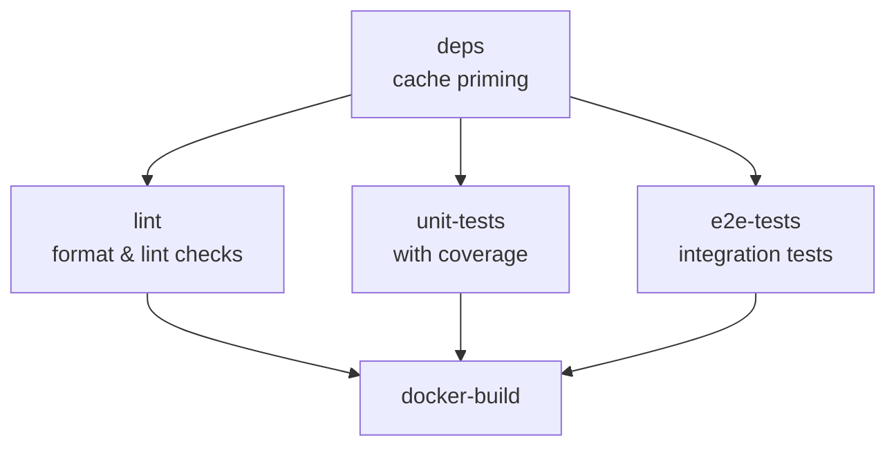

# Deployment

This document covers Docker setup, CI/CD pipelines, and production deployment.

## Docker Support

### Development with Docker

Start supporting services and run the application locally:

```bash
# Start supporting services (MongoDB, Redis, Grafana OTEL)
docker-compose up -d

# Run the application locally with hot reload
pnpm run start:dev
```

### Docker Compose Services

The `docker-compose.yml` includes:

| Service        | Port             | Description                              |
| -------------- | ---------------- | ---------------------------------------- |
| `app`          | 3000             | Main application (development mode)      |
| `mongodb`      | 27017            | MongoDB database                         |
| `redis`        | 6379             | Redis cache for chart data               |
| `grafana-otel` | 3001, 4317, 4318 | Grafana OTEL collector for observability |

### Production Build

```bash
# Build Docker image
docker build -t command-centre-api .

# Run container
docker run -p 3000:3000 --env-file .env command-centre-api
```

### Multi-Stage Dockerfile

The Dockerfile uses multi-stage builds:

1. **base**: Node.js 24.5.0 with pnpm
2. **deps**: Install dependencies
3. **build**: Compile TypeScript
4. **development**: Development target with hot reload
5. **production**: Optimized production image

```bash
# Build for production (default)
docker build -t command-centre-api .

# Build for development
docker build --target development -t command-centre-api:dev .
```

### Build Arguments

| Argument                | Description                                |
| ----------------------- | ------------------------------------------ |
| `PERSONAL_ACCESS_TOKEN` | GitHub PAT for private packages            |
| `APP_VERSION`           | Version label for the image                |
| `APP_NAME`              | Service name (default: command-centre-api) |

## CI/CD

### GitHub Actions Workflows

The project includes workflows in `.github/workflows/`:

| Workflow               | Trigger           | Description                                       |
| ---------------------- | ----------------- | ------------------------------------------------- |
| `ci.yml`               | Push to main, PRs | Lint, format, unit tests, E2E tests, Docker build |
| `deploy-staging.yml`   | Manual/Auto       | Deploy to staging environment                     |
| `deploy-prod.yml`      | Manual            | Deploy to production                              |
| `stale-pr-cleanup.yml` | Scheduled         | Clean up stale pull requests                      |
| `reset-dev-branch.yml` | Manual            | Reset development branch                          |

### CI Pipeline

The CI pipeline runs in parallel after dependency caching:



### Pipeline Environment Variables

```yaml
NODE_ENV: test
APP_NAME: command-centre-api
LOG_LEVEL: error
METRICS_ENABLED: false
TRACING_ENABLED: false
```

## Production Checklist

Before deploying to production, ensure:

### Configuration

- [ ] Set `NODE_ENV=production`
- [ ] Configure production MongoDB connection
- [ ] Configure production Redis connection (`REDIS_WRITE_URL`, `REDIS_READ_URL`)
- [ ] Set secure `JWT_SECRET` (use crypto-generated value)
- [ ] Set secure `OPENAI_API_KEY`
- [ ] Configure `PAYSTACK_API_BASE_URL` for production

### Security

- [ ] Review and secure all environment variables
- [ ] Configure SSL/TLS certificates
- [ ] Enable HTTPS-only access
- [ ] Set up proper CORS configuration
- [ ] Review rate limiting settings

### Monitoring

- [ ] Configure OTLP exporters for logs, traces, metrics
- [ ] Set up monitoring and alerting
- [ ] Configure log aggregation
- [ ] Set up health check monitoring

### Database

- [ ] Set up MongoDB replica set for high availability
- [ ] Configure backup strategies
- [ ] Set up database monitoring
- [ ] Run pending migrations

### Cache

- [ ] Set up Redis with persistence (AOF or RDB)
- [ ] Configure Redis password authentication
- [ ] Set up Redis replica for read scalability (optional)
- [ ] Configure Redis memory limits and eviction policy
- [ ] Set up Redis monitoring

### Infrastructure

- [ ] Configure load balancing
- [ ] Set up auto-scaling rules
- [ ] Configure resource limits (CPU, memory)
- [ ] Set up disaster recovery procedures

## Available Scripts

### Development

```bash
pnpm run start:dev      # Start with hot reload
pnpm run start:debug    # Start with debugger attached
```

### Production

```bash
pnpm run build          # Build the application
pnpm run start:prod     # Start production server
```

### Code Quality

```bash
pnpm run lint           # Run ESLint and fix issues
pnpm run lint:check     # Check without fixing
pnpm run format         # Format code with Prettier
pnpm run format:check   # Check formatting
```

### Testing

```bash
pnpm run test           # Run unit tests
pnpm run test:watch     # Run tests in watch mode
pnpm run test:cov       # Run tests with coverage
pnpm run test:e2e       # Run end-to-end tests
pnpm run test:all       # Run all tests (unit + e2e)
```

### Database

```bash
pnpm run migration:create   # Create new migration
pnpm run migration:generate # Generate from entity changes
pnpm run migration:run      # Run pending migrations
pnpm run migration:revert   # Revert last migration
pnpm run migration:show     # Show migration status
```

## Health Checks

### Application Health

```bash
curl http://localhost:3000/health
```

Expected response:

```json
{
  "status": "ok",
  "info": {
    "database": { "status": "up" }
  }
}
```

### Container Health

Docker containers should include health checks:

```dockerfile
HEALTHCHECK --interval=30s --timeout=10s --start-period=5s --retries=3 \
  CMD curl -f http://localhost:3000/health || exit 1
```

## Rollback Procedures

### Application Rollback

1. Identify the last working version
2. Deploy the previous Docker image tag
3. Verify health checks pass
4. Monitor for errors

### Database Rollback

```bash
# Revert the last migration
pnpm run migration:revert

# Verify database state
pnpm run migration:show
```

### Emergency Procedures

1. **Scale down** problematic instances
2. **Check logs** for error patterns
3. **Rollback** to last known good state
4. **Investigate** root cause
5. **Document** incident and fix
