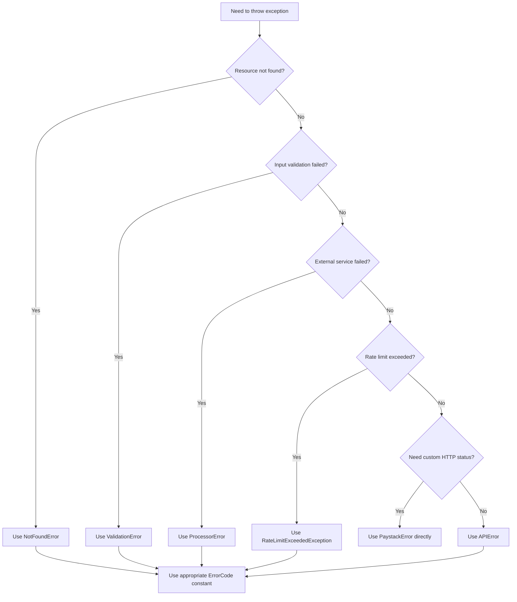

# Error Handling

This document describes how errors are handled and returned to clients in this application.

## Overview

The application uses a global exception filter (`GlobalExceptionFilter`) that catches all unhandled exceptions and formats them into standardized Paystack error responses. This ensures consistent error formatting across the entire API.

All error responses follow the Paystack error response format:

```typescript
{
  status: false,
  type: string,      // Error type (e.g., 'api_error', 'validation_error')
  code: string,      // Specific error code for programmatic handling
  message: string,   // Human-readable error message
  data?: any         // Optional additional error context
}
```

## Exception Types

### PaystackError

The standard Paystack error class for consistent error handling across Paystack services.

- **HTTP Status**: Configurable via `httpStatusCode` property
- **Error Type**: From `@paystackhq/pkg-response-code` ResponseType enum
- **Error Code**: From `@paystackhq/pkg-response-code` ResponseCode enum
- **Use Case**: Standard error handling for all Paystack services

**Example:**

```typescript
import { ResponseCode, ResponseType } from '@paystackhq/pkg-response-code';
import { PaystackError } from './common';

throw new PaystackError({
  httpStatusCode: 400,
  type: ResponseType.API_ERROR,
  code: ResponseCode.INVALID_PARAMS,
  data: { field: 'email', reason: 'invalid format' },
  message: 'Invalid request parameters',
});
```

**Response:**

```json
{
  "status": false,
  "type": "api_error",
  "code": "invalid_params",
  "message": "Invalid request parameters",
  "data": {
    "field": "email",
    "reason": "invalid format"
  }
}
```

### Convenience Exception Classes

The application provides four convenience exception classes that extend `PaystackError` for common error scenarios. These classes reduce boilerplate by automatically setting the correct `ResponseType`:

#### APIError

Used for internal API errors or unknown server-side errors. Automatically sets `type: ResponseType.API_ERROR`.

- **Default HTTP Status**: 500 Internal Server Error
- **Default Code**: `ResponseCode.UNKNOWN`
- **Use Case**: Server-side errors, unexpected failures, system malfunctions

**Example:**

```typescript
import { ResponseCode } from '@paystackhq/pkg-response-code';
import { APIError } from './common';

throw new APIError('Database connection failed', ResponseCode.INTERNAL_ERROR);
```

**Response:**

```json
{
  "status": false,
  "type": "api_error",
  "code": "internal_error",
  "message": "Database connection failed"
}
```

#### ValidationError

Used for validation failures and business rule violations. Automatically sets `type: ResponseType.VALIDATION_ERROR`.

- **Default HTTP Status**: 400 Bad Request
- **Default Code**: `ResponseCode.INVALID_PARAMS`
- **Use Case**: Input validation failures, missing required fields, business rule violations

**Example:**

```typescript
import { ResponseCode } from '@paystackhq/pkg-response-code';
import { ValidationError } from './common';

throw new ValidationError('Email address is invalid', ResponseCode.INVALID_PARAMS, undefined, { field: 'email' });
```

**Response:**

```json
{
  "status": false,
  "type": "validation_error",
  "code": "invalid_params",
  "message": "Email address is invalid",
  "data": {
    "field": "email"
  }
}
```

#### ProcessorError

Used for third-party service failures, timeouts, and external API errors. Automatically sets `type: ResponseType.PROCESSOR_ERROR`.

- **Default HTTP Status**: 408 Request Timeout
- **Default Code**: `ResponseCode.UNKNOWN`
- **Use Case**: External service timeouts, third-party API failures, gateway unavailability

**Example:**

```typescript
import { ResponseCode } from '@paystackhq/pkg-response-code';
import { ProcessorError } from './common';

throw new ProcessorError('Payment gateway timeout', ResponseCode.GATEWAY_TIMEOUT);
```

**Response:**

```json
{
  "status": false,
  "type": "processor_error",
  "code": "gateway_timeout",
  "message": "Payment gateway timeout"
}
```

#### NotFoundError

Used when a requested resource does not exist. Automatically sets `type: ResponseType.API_ERROR`.

- **Default HTTP Status**: 404 Not Found
- **Default Code**: `ResponseCode.NOT_FOUND`
- **Use Case**: Resource not found errors (conversations, charts, users, etc.)

**Example:**

```typescript
import { ResponseCode } from '@paystackhq/pkg-response-code';
import { NotFoundError } from './common';

throw new NotFoundError('Conversation with ID 123 not found', ResponseCode.NOT_FOUND);
```

**Response:**

```json
{
  "status": false,
  "type": "api_error",
  "code": "not_found",
  "message": "Conversation with ID 123 not found"
}
```

## Advanced Usage

### Custom HTTP Status Codes

All exception types support custom HTTP status codes via the `statusOverride` parameter:

```typescript
import { HttpStatus } from '@nestjs/common';
import { ResponseCode } from '@paystackhq/pkg-response-code';
import { APIError } from './common';

// Return 403 Forbidden instead of default 500
throw new APIError('Access denied', ResponseCode.FORBIDDEN, HttpStatus.FORBIDDEN);
```

### Including Additional Data

Use the `data` parameter to provide context about the error:

```typescript
import { ResponseCode } from '@paystackhq/pkg-response-code';
import { ValidationError } from './common';

throw new ValidationError('Multiple validation errors', ResponseCode.INVALID_PARAMS, undefined, {
  errors: [
    { field: 'email', reason: 'invalid format' },
    { field: 'phone', reason: 'required' },
  ],
});
```

## HTTP Exception Handling

Standard NestJS `HttpException` instances are also caught and formatted:

```typescript
import { BadRequestException } from '@nestjs/common';

throw new BadRequestException('Invalid request');
```

**Response:**

```json
{
  "status": false,
  "type": "api_error",
  "code": "http_exception",
  "message": "Invalid request"
}
```

## Standardized Error Codes

The application provides a centralized set of error codes in `src/common/exceptions/error-codes.ts` to ensure consistency across error handling:

```typescript
import { ErrorCodes } from './common';

// Resource not found
throw new NotFoundError('Chart not found', ErrorCodes.CHART_NOT_FOUND);

// Validation errors
throw new ValidationError('Invalid date range', ErrorCodes.INVALID_DATE_RANGE);

// Business logic errors
throw new ValidationError('Conversation is closed', ErrorCodes.CONVERSATION_CLOSED);
```

**Available Error Codes:**

- **Resource Not Found**: `CONVERSATION_NOT_FOUND`, `CHART_NOT_FOUND`, `RESOURCE_NOT_FOUND`
- **Validation**: `INVALID_PARAMS`, `INVALID_RESOURCE_TYPE`, `INVALID_AGGREGATION_TYPE`, `INVALID_DATE_RANGE`, `INVALID_STATUS`, `MISSING_REQUIRED_FIELD`
- **Business Logic**: `CONVERSATION_CLOSED`, `CONTEXT_MISMATCH`, `CONVERSATION_MODE_LOCKED`
- **Rate Limiting**: `RATE_LIMITED`
- **Internal**: `INTERNAL_ERROR`, `UNKNOWN`

### Chat Mode Validation Errors

The system enforces strict conversation mode consistency. These errors occur when attempting to violate mode or context rules:

**`CONVERSATION_MODE_LOCKED`** - Occurs when:

- Attempting to use page-scoped mode on a global conversation
- Attempting to use global mode on a page-scoped conversation
- Attempting to convert an existing global conversation to page-scoped

**`CONTEXT_MISMATCH`** - Occurs when:

- Attempting to use a different resource type in a page-scoped conversation
- Attempting to use a different resource ID in a page-scoped conversation

**`MISSING_REQUIRED_FIELD`** - Occurs when:

- Using mode "page" without providing `pageContext`
- Providing incomplete `pageContext` (missing `type` or `resourceId`)

**Example Error Response:**

```json
{
  "status": false,
  "type": "validation_error",
  "code": "conversation_mode_locked",
  "message": "Conversation is page-scoped and must use mode \"page\""
}
```

### Message Validation

The `validateMessages()` method validates message history against tool schemas using the Vercel AI SDK. When validation fails:

- A `TypeValidationError` is caught and logged
- The system continues with empty message history to prevent request failure
- Error is logged for monitoring: `"Database messages validation failed"`

This graceful degradation ensures that:

- Schema evolution doesn't break existing conversations
- Users can continue chatting even if old messages are incompatible
- System remains resilient to message format changes

## Exception Selection Guide

Use this decision tree to choose the right exception class:



## Best Practices

1. **Use convenience classes for common errors**: Use `NotFoundError`, `ValidationError`, `APIError`, or `ProcessorError` for typical scenarios - they automatically handle the boilerplate
2. **Use standardized error codes**: Import and use `ErrorCodes` constants instead of hardcoding error codes
3. **Use PaystackError for specific cases**: Use `PaystackError` directly when you need full control over the error type and code
4. **Provide clear messages**: Write human-readable error messages that help users understand what went wrong
5. **Include context in data**: Use the `data` parameter to provide additional error context (e.g., validation details, affected fields)
6. **Don't use NestJS built-in exceptions**: Avoid `NotFoundException`, `BadRequestException`, etc. - use our custom exception classes instead for consistent error formatting
7. **Avoid generic Error class**: Never throw generic `Error` instances - always use one of our custom exception classes

## Error Logging

All exceptions caught by the global filter are automatically logged with the format:

```
[GlobalExceptionFilter] {error_type}: {error_message}
```

This provides visibility into errors occurring in your application for monitoring and debugging purposes.
